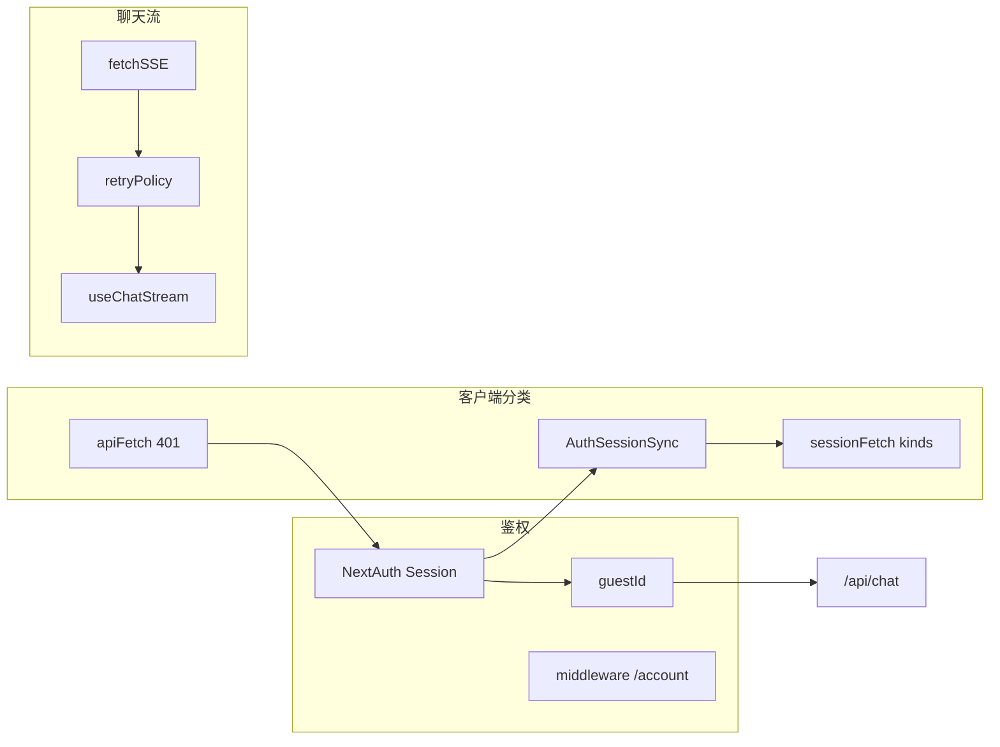

# 鉴权与失败分类（功能说明）

**项目**：the-wild-oasis-website  
**类型**：Next.js 14 App Router + NextAuth v5 + Supabase  
**文档日期**：2026-04-08  

本文档从业务能力角度说明 **鉴权（Authentication）**、**授权（Authorization）** 与 **失败分类（Failure taxonomy）**，并指向关键实现文件。

---

## 1. 功能概览

```text
the-wild-oasis-website
├── 鉴权（Authentication）
│   ├── GitHub OAuth（NextAuth）
│   ├── 会话与业务身份（guestId 注入 session）
│   ├── 路由级保护（middleware：/account）
│   └── Server Actions / API 内 auth() 校验
├── 客户端会话模型
│   ├── Zustand：loading / authenticated / unauthenticated + isStale
│   ├── sessionStorage 缓存 + 断网「乐观会话」
│   └── 显式 /api/auth/session：unauthorized | network | http
├── 失败分类
│   ├── HTTP：401 / 403 / 429 / 503 / 4xx 业务校验
│   ├── SSE 聊天：UNAUTHORIZED / FORBIDDEN / 超时 / 流不完整 / 其它
│   ├── 重试策略：可重试 vs 不可重试（retryPolicy）
│   └── 统一 401 清理：apiFetch → 清本地数据 + signOut → /login
└── 授权（Authorization）
    └── 预订：仅允许操作自己的 booking（Server Actions）
```

---

## 2. 鉴权详解

### 2.1 身份提供者与会话扩展

| 项 | 说明 |
|----|------|
| **作用** | GitHub 登录；将业务 guest 与 NextAuth session 绑定（`guestId`）。 |
| **实现** | `lib/auth.js`：`GitHubProvider`；`callbacks.session` 中 `getGuest` 并设置 `session.user.guestId`；`signIn` 中若无 guest 则 `createGuest`。 |
| **失败** | `signIn` 内 `try/catch` 失败时返回 `false`，拒绝登录（不对外细分错误类型）。 |

### 2.2 路由保护（Middleware）

| 项 | 说明 |
|----|------|
| **作用** | 未登录访问受保护路径时由 NextAuth 处理（`authorized`：必须有 `auth?.user`）。 |
| **实现** | `middleware.js` 导出 `auth`，`matcher` 为 `["/account"]`。 |
| **范围** | **仅 `/account` 路径** 由该 middleware 拦截；其它页面（含聊天页）不依赖此 matcher。 |

### 2.3 服务端鉴权：Server Actions

| 项 | 说明 |
|----|------|
| **作用** | 更新客人资料、创建/删除/更新预订前调用 `auth()`。 |
| **无会话** | `throw new Error("You must be logged in")`（应用层错误，非 HTTP 401）。 |
| **实现** | `lib/actions.js` |

### 2.4 服务端鉴权：/api/chat

| 条件 | 响应 |
|------|------|
| 无 `session?.user` | `401` + `{ error: "Unauthorized" }` |
| 无 `guestId` | `401` + `{ error: "Guest ID not found" }` |

**实现**：`app/api/chat/route.ts`

### 2.5 客户端会话状态（AuthStatus）

| 状态 | 含义 |
|------|------|
| `loading` | 会话尚未确定 |
| `authenticated` | 已登录；可选 `isStale: true` 表示基于缓存、待服务端确认 |
| `unauthenticated` | 未登录 |

**类型**：`lib/auth/authTypes.ts`  
**Store**：`store/authSessionStore.ts`  
**同步逻辑**：`lib/auth/AuthSessionSync.tsx`（`useSession` + sessionStorage + 显式 `fetchSessionExplicit`）

**断网误报**：NextAuth 报 `unauthenticated` 时，若 sessionStorage 仍有未过期 session，则保持 `authenticated` + `isStale: true`，并退避重试拉取 `/api/auth/session`。

---

## 3. 失败分类详解

### 3.1 显式会话拉取（fetchSessionExplicit）

**文件**：`lib/auth/sessionFetch.ts`

| 结果 | 含义 |
|------|------|
| `ok: true, session` | 成功；`session` 可为 `null`（未登录） |
| `ok: false, kind: "unauthorized"` | HTTP 401 |
| `ok: false, kind: "network"` | `fetch` 抛错（如断网） |
| `ok: false, kind: "http"` | 其它非 2xx |

用于区分「真的未登录」与「网络/服务端异常」，供 `AuthSessionSync` 决策是否清缓存、是否保持 `loading`。

### 3.2 同源业务 API（apiFetch）

**文件**：`lib/http/apiFetch.ts`

- 仅当响应 **`401`** 且 URL 为同源 **`/api/*`** 且 **非** `/api/auth/*` 时触发统一处理。
- 处理：清聊天持久化、草稿、会话 store、`clearCachedSession`、`resetAuthToUnauthenticated`、**`signOut({ callbackUrl: "/login" })`**。

普通 `fetch` 不会自动登出；走 `apiFetch` 的业务接口才会在 401 时执行全量清理与跳转。

### 3.3 SSE 客户端与重试策略

**文件**：

- `lib/sseClient/client.ts`：HTTP 层将 `401`/`403` 转为 `Error("UNAUTHORIZED")` / `Error("FORBIDDEN")` 并附加 `statusCode`。
- `lib/sseClient/retryPolicy.ts`：`isLikelyNetworkError`、`isRetryableChatError` 等。

**isRetryableChatError（摘要）**

| 情况 | 可重试 |
|------|--------|
| 用户取消（`AbortError`） | 否 |
| `UNAUTHORIZED` / `FORBIDDEN` 或 status 401/403 | 否 |
| 429、≥500、超时、`SSEIncompleteError`、典型网络错误等 | 是（具体见代码） |

### 3.4 聊天发送（useChatStream）

**文件**：`lib/sseClient/useChatStream.ts`

| 错误类型 | 行为摘要 |
|----------|----------|
| `AbortError` | 用户停止；静默结束 |
| 401 / `UNAUTHORIZED` | 不 flush 缓冲；回滚最近 2 条消息；`setAuthBlocked(true)` |
| 不可重试或超过重试次数 | 按 `SSEIncompleteError` / 网络等展示对应中文提示 |

### 3.5 /api/chat 服务端 HTTP 谱系（节选）

除鉴权相关 **401** 外，还包括：

| 状态码 | 场景（节选） |
|--------|----------------|
| 429 | 限流（含 `Retry-After`） |
| 503 | Redis 不可用（限流依赖） |
| 400 | 请求体验证、预算超限等 |
| 404 | 续传时会话过期 |
| 403 | 续传时 `guestId` 与流会话不匹配 |

**实现**：`app/api/chat/route.ts`

---

## 4. 鉴权与授权区分

| 概念 | 本项目中的体现 |
|------|----------------|
| **鉴权** | 你是谁：GitHub OAuth、session、`guestId` |
| **授权** | 你能操作哪条数据：如 `deleteBooking` / `updateBooking` 校验 `bookingId` 属于当前 `guestId` |

---

## 5. 依赖关系简图



---

## 6. 建议阅读顺序

1. `lib/auth.js`、`middleware.js`
2. `lib/auth/authTypes.ts`、`lib/auth/AuthSessionSync.tsx`、`lib/auth/sessionFetch.ts`
3. `lib/http/apiFetch.ts`
4. `lib/sseClient/retryPolicy.ts`、`lib/sseClient/client.ts`、`lib/sseClient/useChatStream.ts`
5. `app/api/chat/route.ts`

---

## 7. 已知边界

- Middleware 仅保护 `/account`；聊天能力主要依赖 API 401 与客户端状态，而非全局路由守卫。
- `signIn` 回调失败时统一 `return false`，未向用户暴露细分原因（如数据库不可用）。
