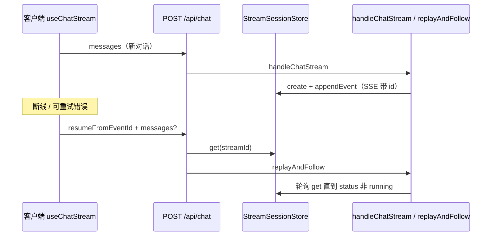

# 断点续传（SSE 续传）功能说明

**项目**：the-wild-oasis-website  
**类型**：Next.js + SSE 聊天  
**文档日期**：2026-04-08  
**更新**：2026-04-09（补充客户端重试循环、`fetchSSE` 未完成流、UI、文件索引与面试要点）

本文档说明 **断点续传** 的业务价值、事件模型、服务端重放、客户端游标与失败语义，并指向关键实现文件。

---

## 1. 功能概览

```text
the-wild-oasis-website — 断点续传
├── 服务端事件缓冲
│   ├── 每条 SSE 分配单调 seq 与 id（streamId:seq）
│   ├── appendEvent 写入 StreamSessionStore（内存 / Redis）
│   └── 超上限时「丢头」保留尾部（5A 策略）
├── 首连与跟随（replay + follow）
│   ├── 新对话：handleChatStream → createStreamSession → 边生成边缓冲
│   └── 断线重连：replayAndFollow(seq > 上次) → 若仍 running 则轮询补新事件
├── 客户端续传请求
│   ├── 记录 lastEventId（成功解析的 SSE id）
│   ├── 重试时 POST { resumeFromEventId, messages? }
│   └── 无 lastEventId 则无法续传（固定提示文案）
└── 网关与安全
    ├── 限流与 resume 共用配额（先于 body）
    ├── resume 校验：parseEventId、会话存在、guestId 一致
    └── 404 / 403 / 400 等失败语义
```

---

## 2. 用户价值

- **作用**：在 **SSE 连接中断**（网络抖动、超时、浏览器切后台等）时，客户端可 **带着上次收到的游标** 再连，服务端 **重放已缓冲事件** 并 **继续推送未完成流**，避免整轮对话作废、减轻重复生成成本。
- **边界**：依赖服务端仍持有该 `streamId` 会话；会话过期、进程重启（纯内存且无持久化）、或缓冲被裁剪导致游标早于缓冲区，都会导致 **无法续传**。

---

## 3. 事件标识与缓冲模型

### 3.1 `id` 格式

- **约定**：`"${streamId}:${seq}"`，`streamId` 为 UUID（不含 `:`），`seq` 为单调递增整数。
- **解析**：`parseEventId` 用 **最后一个 `:`** 切开，得到 `streamId` 与 `seq`（`lib/sseServer/streamSession.ts`）。

### 3.2 会话与事件

- **`StreamSession`**：`streamId`、`guestId`、`seq`、**`events[]`**、`status: "running" | "done" | "error"`（`lib/sseServer/streamSessionStore.ts`）。
- **`BufferedEvent`**：`seq`、`id`、**`sse`**（已格式化的整段 SSE 文本，便于原样重放）。

### 3.3 写入路径（首连）

- `handleChatStream` 为每次新对话 **`createStreamSession`**，得到新 `streamId`（`lib/sseServer/chatHandler.ts`）。
- `createSSEWriter` 每写一条事件：`session.seq += 1`，拼 `id`，**`formatSSE` → `store.appendEvent`**，再尝试 `writer.write`；**写失败只断开当前 HTTP，不把会话判死**，后续事件仍进缓冲供续传（注释：writer 写失败视为客户端断开，继续缓冲供续传）。

### 3.4 缓冲上限（5A / 丢头）

- `appendEvent` 受 **`maxEvents` + `maxBytes`** 约束（`getBufferLimits()`），超出时从队列 **头部删除** 旧事件，保证尾部最新（内存与 Redis Lua 语义一致）。
- **风险**：若客户端持有的 `lastEventId` 早于已被丢弃的事件，重放只能基于 **仍保留在缓冲内** 的事件；极端情况下可能影响「从最早字节完整续传」的预期。

---

## 4. 续传核心：`replayAndFollow`

- **入口**：`POST /api/chat` 且 body 含 **`resumeFromEventId`**（`app/api/chat/route.ts`）。
- **流程摘要**：
  1. `parseEventId` 失败 → **400** `Invalid resume id`。
  2. `store.get(streamId)` 无 → **404** `Session expired`。
  3. `streamSession.guestId !== guestId` → **403** `Forbidden`。
  4. 建立 **TransformStream**，异步执行 **`replayAndFollow(store, streamId, parsed.seq, writer, encoder)`**。
- **`replayAndFollow` 逻辑**（`lib/sseServer/streamSession.ts`）：
  - `watermark = lastSeqExclusive`（请求体中的 event id 解析出的 seq，表示「已消费到最后一条」的水位）。
  - 循环：读 session，把 **`ev.seq > watermark`** 的事件按顺序 **`writer.write(ev.sse)`**。
  - 若 **`session.status === "running"`** 且本轮没有新事件（`!advanced`），**`setTimeout(50ms)`** 再拉，实现 **跟随未完成流**。
  - 直到 `status !== "running"` 或 session 消失（`get` 返回 null 则结束）。

---

## 5. 客户端：何时带 `resumeFromEventId`

- **位置**：`lib/sseClient/useChatStream.ts` 重试循环。
- **条件**：`round > 0`（已进入重试）时，若存在 **`lastEventId`**（来自已成功解析且带 `id` 的 SSE 事件），则 body 为  
  `{ messages: messagesToSend, resumeFromEventId: lastEventId }`；否则 **不续传**，提示「连接中断且无法从断点续传，请重试发送。」并结束。
- **`lastEventId` 更新**：每处理一条带 `event.id` 的事件，去重后加入 `seenIds`，并 **`lastEventId = event.id`**。

---

## 6. 与「可重试错误」的配合

- **`isRetryableChatError`**（`lib/sseClient/retryPolicy.ts`）在 **401/403、UNAUTHORIZED/FORBIDDEN** 等情况下 **不重试**；网络类、超时、`SSEIncompleteError` 等可重试，才会进入下一轮并可能携带 **`resumeFromEventId`**。
- **401 在聊天流里**：`useChatStream` 对 UNAUTHORIZED 走 **回滚消息 + `setAuthBlocked`**，不走断点续传语义。

---

## 7. 存储与部署含义

| 后端 | 行为对续传的影响 |
|------|------------------|
| **MemoryStreamSessionStore**（默认） | 单进程；会话 **done/error 后延迟删除**；仅适合单机开发或小规模。 |
| **RedisStreamSessionStore**（`CHAT_SESSION_STORE=redis`） | 多实例可共享会话；带 **TTL**，过期即 **404 Session expired**。 |

**与 IndexedDB 的区别**：浏览器 IndexedDB（`lib/chat/chatPersistence.ts`）存的是 **本机对话 UI 快照**；Redis/内存里的是 **服务端 SSE 流缓冲**，供 `replayAndFollow` 使用，二者不是同一层数据。

---

## 8. 请求体验证（resume 模式）

- **`validateChatRequestBody(body, "resume")`**：允许 **无 messages** 的纯续传；若带 `messages` 则仍做条数与内容校验（`lib/chat/validateRequest.ts`）。
- **类型**：`types/chat.ts` 中 `ChatRequestBody` 含 `resumeFromEventId` 说明。

---

## 9. 依赖关系简图



---

## 10. 已知边界与可增强点

- **跨设备 / 超 TTL**：无法续传，只能重新发送（设计预期内）。
- **缓冲丢头**：极端长流下，极早的 `resumeFromEventId` 可能无法完整重放（依赖缓冲大小与实现）。
- **多 Tab**：同一用户多路并发流需不同 `streamId`，由服务端每次 `create` 保证。

---

## 11. 建议阅读顺序

1. `lib/sseServer/streamSession.ts`：`parseEventId`、`createSSEWriter`、`replayAndFollow`
2. `lib/sseServer/streamSessionStore.ts` + `streamSession.memory.ts` / `streamSession.redis.ts`
3. `app/api/chat/route.ts`：resume 分支与 HTTP 状态码
4. `lib/sseClient/useChatStream.ts`：`lastEventId` 与重试体
5. `lib/sseServer/chatHandler.ts`：新流如何持续 `appendEvent`

---

## 12. 客户端重试循环（`useChatStream`）

- **位置**：`lib/sseClient/useChatStream.ts`，在单次 `sendMessage` 内用 `for (let round = 0; round <= MAX_RETRY_ROUNDS; round++)` 驱动。
- **`MAX_RETRY_ROUNDS`**：在 `lib/sseClient/retryPolicy.ts` 中定义为 **5**。循环条件为 `round <= 5`，即 **最多 6 次连接尝试**（`round === 0` 为初次请求，`round === 1..5` 为重试）。与「共 5 次重试」表述一致时，注意区分「轮次索引」与「总次数」。
- **指数退避**：进入重试轮（`round > 0`）且具备 `lastEventId` 时，先 `setStreamReconnecting(true)`，再 `await retryDelayMs(round)`。`retryDelayMs` 为 `min(1000 * 2^(round-1), 32000)` ms（第 1 次重试约 1s，第 5 次约 16s，上限 32s）。
- **续传请求体**：`round > 0` 且存在 `lastEventId` 时，`body = { messages: messagesToSend, resumeFromEventId: lastEventId }`；否则若已进入重试但无游标，提示「连接中断且无法从断点续传，请重试发送。」并 `dispatchChat(ERROR)`。
- **缓冲与状态机**：每次进入下一轮前对 `createStreamingTextSink` 执行 **`textSink.flushAll()`**，避免 delta 留在缓冲里与续传事件错位；用户取消通过 `streamCancelGeneration` 与 `AbortController` 中止，并清理 `streamReconnecting`。
- **重连提示清除**：续传连接上后，**第一个** SSE 事件到达时 `setStreamReconnecting(false)`（`clearedReconnectHint` 标志），避免一直显示「正在重试」。

---

## 13. `fetchSSE`：超时与「未完成流」错误

- **位置**：`lib/sseClient/client.ts`。
- **首字节超时**：默认 10s 内未收到响应则中止，抛出 `TimeoutError`，消息为 `First byte timeout`（属可重试）。
- **空闲超时**：两次数据块之间默认超过 30s 无新数据则中止，`Idle timeout`（可重试）。
- **`SSEIncompleteError`**：ReadableStream 正常结束（`reader.read()` 的 `done === true`）但 **未收到** `event: done` 时，构造 `Error("Stream ended without done event")`，`name === "SSEIncompleteError"`，经 `onError` 传出；`isRetryableChatError` 视为可重试，从而触发断点续传。

---

## 14. UI：重连中提示

- **`streamReconnecting`**：`store/chatUIStore.ts`，SSE 断线自动重连等待期间为 `true`。
- **展示**：`components/chat/MessageList.tsx` 将 `streamReconnecting` 传给最后一条助手气泡；`components/chat/MessageBubble.tsx` 在 `reconnectHint` 为真时展示：「连接中断，正在重试…」。

---

## 15. 关键文件索引

| 文件 | 职责 |
|------|------|
| `lib/sseClient/useChatStream.ts` | 重试循环、`lastEventId` / `seenIds`、`resumeFromEventId`、与 `textSink` 配合 |
| `lib/sseClient/retryPolicy.ts` | `isRetryableChatError`、`retryDelayMs`、`MAX_RETRY_ROUNDS` |
| `lib/sseClient/client.ts` | `fetchSSE`、超时、`SSEIncompleteError` |
| `app/api/chat/route.ts` | `resumeFromEventId` 分支、`replayAndFollow` |
| `lib/sseServer/streamSession.ts` | `parseEventId`、`createSSEWriter`、`replayAndFollow` |
| `lib/sseServer/streamSessionStore.ts` | 会话存储契约（内存 / Redis） |
| `store/chatUIStore.ts` | `streamReconnecting` |
| `components/chat/MessageList.tsx`、`MessageBubble.tsx` | 重连文案 |

---

## 16. 面试要点（STAR）

- **Situation**：流式聊天在弱网或代理环境下易中途断开，若仅报错失败，用户需整轮重发，体验与成本差。
- **Task**：在服务端仍保留会话与事件缓冲的前提下，让客户端能 **自动重试** 并 **从上次事件 id 续传**。
- **Action**：服务端为每条 SSE 生成 **`streamId:seq` id** 并写入 **StreamSessionStore**；断开时仍继续缓冲。客户端维护 **`lastEventId` + 去重**，对可重试错误做 **指数退避**，POST **`resumeFromEventId`**；路由走 **`replayAndFollow`** 重放并 **轮询跟随** `running` 会话。
- **Result**：用户看到短暂「正在重试」后，多数场景可继续同一条助手回复（受会话 TTL、缓冲上限、游标有效性约束）；认证错误走回滚而非续传。
