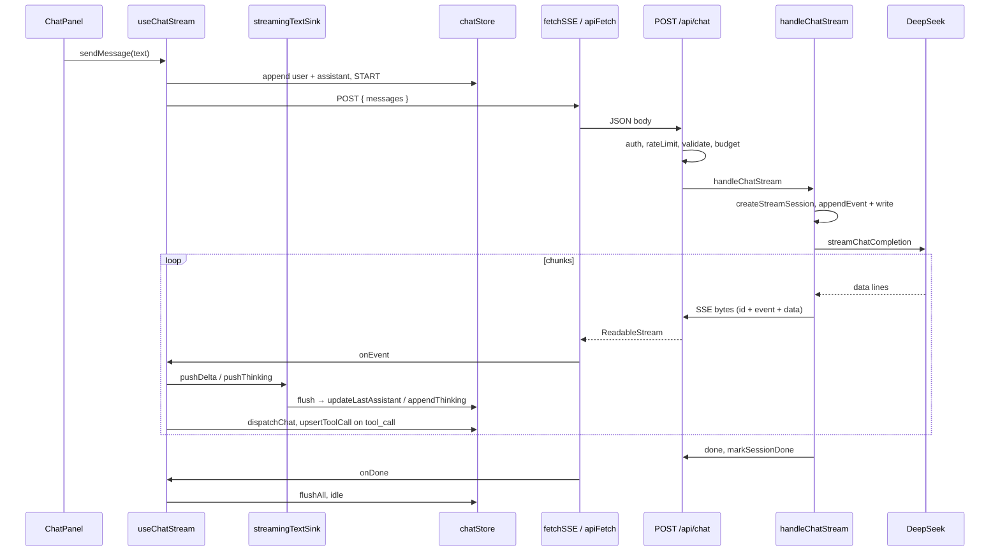

# 对话（SSE）详细实现流程

## 功能概述

用户在聊天面板输入内容后，客户端通过 **POST `/api/chat`** 与服务器建立 **SSE（text/event-stream）** 长连接，流式接收推理过程、正文增量与工具调用结果；服务端将 **DeepSeek 流式 API** 的输出标准化为统一事件，并写入可续传的会话缓冲，从而在断网或超时后支持 **带 `resumeFromEventId` 的自动重试与回放**。

---

## 核心技术实现

### 1. 服务端入口：Route Handler、鉴权与分流

模块结合 **Next.js App Router** 的 **Route Handler**（`app/api/chat/route.ts`）。`POST` 处理器不返回 JSON 流式以外的“普通成功体”给主路径：对 **新对话** 与 **断点续传** 均构造 `TransformStream`，将 `writable` 侧交给异步 IIFE 写入，把 `readable` 作为 `Response` 返回，并设置 `Content-Type: text/event-stream`、`Cache-Control: no-cache`、`X-Accel-Buffering: no` 等头，避免代理缓冲打断 SSE。

处理顺序体现安全与成本控制：**NextAuth `auth()`** 校验会话；从 `session.user` 取 **guestId**（无则 401）；**限流** `assertChatRateLimit`（续传与新聊共用配额，失败 429 或 Redis 不可用 503）；解析 JSON 后按 **`resumeFromEventId` 是否存在** 分别调用 `validateChatRequestBody(..., "resume" | "chat")`；对有 `messages` 的请求做 **budget**（`applyBudgetOrThrow`，按 token 或字符裁剪上下文）。

**分流逻辑**：若存在合法的 `resumeFromEventId`，则 `parseEventId` 得到 `streamId` 与已确认的 `seq`，从 `getStreamSessionStore()` 取会话，校验 **guestId 与会话归属**（404/403），再 **`replayAndFollow`** 只向当前 HTTP 连接重放 `seq` 之后的事件并轮询直至会话结束。否则进入 **新对话**：要求 `messages` 非空，异步调用 **`handleChatStream`**。两路均在异常时向流中写入 `error` 事件并 `writer.close()`。

### 2. 服务端对话核心：流会话、SSE 写入与 LLM 消费

**`handleChatStream`**（`lib/sseServer/chatHandler.ts`）为业务主循环：先 **`createStreamSession(guestId, store)`**，再 **`createSSEWriterWithBufferLimits`**。写入器每发一条事件会递增序号、生成 **`id: streamId:seq`**，用 **`formatSSE`** 拼出标准 SSE 文本，并 **`store.appendEvent`**（受 `getBufferLimits()` 限制的事件数/字节数）；随后尝试 **`writer.write`**。若客户端已断开导致写入失败，会将 `writerRef.current` 置空，**但事件仍进入存储**，供后续 **`resumeFromEventId`** 连接拉齐。

每一轮调用 **`streamChatCompletion`**（`lib/ai/provider.ts`）请求 **DeepSeek** `stream: true`，将返回的 **`ReadableStream`** 交给 **`consumeLLMStream`**：按行解析 `data:`，把 **`reasoning_content`** 映射为 **`thinking`** 事件、**`content`** 映射为 **`delta`**，并合并分片的工具调用。若无工具调用则结束该轮；若仅有推理无正文，会补发 **`delta`**。若存在工具调用，则对每条工具 **`executeTool`**，并通过 **`tool_call`** 事件上报 `running` / `done` / `error`，再把 **`role: tool`** 消息追加进 `messages`，最多 **`MAX_TOOL_ROUNDS`** 轮以防死循环。成功则 **`writeSSE("done")`** 并 **`markSessionDone`**；异常则 **`markSessionError`** 并向上抛出，由路由层补写 **`error`** 事件。

### 3. 客户端传输层：fetch + ReadableStream 与超时语义

**`fetchSSE`**（`lib/sseClient/client.ts`）使用 **`apiFetch`**（`lib/http/apiFetch.ts`）发起 POST：同源业务 API 若返回 **401**，会清空本地聊天持久化、草稿并 **`signOut`** 跳转登录，因此与聊天 **`sendMessage`** 内的 **401 特判（回滚两条消息、`setAuthBlocked`）** 形成双重策略——流式请求同样走 `apiFetch`，需理解全局 401 与会话失效处理。

传输层使用 **`response.body.getReader()`** 逐块读取，缓冲区按 **`\n\n`** 切分 SSE 帧，**`parseSSEEvent`** 解析 `id` / `event` / `data`（支持多行 data）。**首字节超时**与**空闲超时**通过内部 `AbortController` 实现：收到响应头后清除首字节定时器；每收到一块数据重置空闲定时器。收到 **`done`** 时先 `onEvent` 再 **`onDone`** 并结束；收到 **`error`** 则 `onError`；若 TCP 正常结束但未收到 `done`，抛出 **`SSEIncompleteError`**，供重试策略识别。用户通过外部 **`signal`** 取消时，`abortState.kind === "user"` 则不触发 `onError`，与 **`stopMessage`** 一致。

### 4. 客户端业务层：useChatStream、状态机与性能优化

**`useChatStream`**（`lib/sseClient/useChatStream.ts`）在 **`sendMessage`** 中：确保已认证；若当前非 idle 则先 **`stopMessage`**；无活跃会话则 **`createConversation`**；追加 **user** 与空 **assistant** 占位，**`dispatchChat(START)`**。通过 **`buildApiMessagesForRequest`** 过滤被用户中断的 assistant、空壳 assistant，并在连续两条 user 之间插入占位 assistant，避免上游消息格式异常。

**`fetchSSEOnce`** 包装 **`fetchSSE`**，使单次连接以 Promise settle。核心是一条 **重试 for 循环**（最多 **`MAX_RETRY_ROUNDS`** 次尝试，见 `retryPolicy`）：维护 **`seenIds`** 与 **`lastEventId`**；首次请求体为 `{ messages }`，重试且存在 `lastEventId` 时为 **`{ messages, resumeFromEventId }`**，与路由续传分支对齐。重试前 **`textSink.flushAll()`**，避免缓冲与续传事件错位；重试间隔 **`retryDelayMs` 指数退避**。**`isRetryableChatError`** 覆盖网络错误、超时、5xx、429、`SSEIncompleteError` 等；**401/403/AbortError** 不重试。

**性能**：**`createStreamingTextSink`**（`lib/chat/streamingTextSink.ts`）对 **`delta` / `thinking`** 做 **requestAnimationFrame + 最大延迟** 批量 flush，再调用 **`updateLastAssistant`** / **`appendThinking`**，降低 Zustand + Immer 的更新频率。**`tool_call`** 到达前 **`flushAll`**，再 **`upsertToolCall`**，保证工具卡片与正文顺序稳定。

**状态**：**`chatReducer`**（`lib/chat/stateMachine.ts`）将 SSE 类型映射为 **THINKING / DELTA / TOOL_CALL / DONE / ERROR**，驱动 **`chatState`**（等待、思考、工具、回答等）。**`useChatUIStore`** 提供 **`registerAbort`**、**`streamReconnecting`**、**`streamCancelGeneration`**：用户点停止时 **`bumpStreamCancelGeneration`** + **`abort()`**，异步循环中若代际变化则退出；**401** 时 **`popLastMessages(2)`** 并 **`setAuthBlocked(true)`**，且 **不清 flush 缓冲**（与注释中的回滚策略一致）。

### 5. 安全与资源控制

- **身份**：所有聊天请求依赖 **NextAuth 会话** 与 **guestId**，续传时校验会话 **streamId 归属**，防止跨用户读缓冲。
- **滥用**：**限流**先于大 body 逻辑；**validateChatRequestBody** 区分新聊与续传；**budget** 限制上下文长度。
- **工具**：**`executeTool`** 在服务端执行，参数由模型产出，经 JSON 解析后执行，错误以 **`tool_call` error** 回传，不阻断整段会话（由模型后续处理）。

### 6. 副作用与用户体验

- **停止生成**：abort + 状态机 ERROR + 可选 **`markLastAssistantStreamStopped`**，后续 **`buildApiMessagesForRequest`** 不再发送该条 assistant。
- **断线重连 UI**：重试轮次 **`setStreamReconnecting(true)`**，收到续传后第一个事件再清除。
- **持久化**：`ChatPersistenceProvider` 与 **`useChatStore`** 订阅保存会话列表（与流式逻辑解耦）。

---

## 数据流 / 交互时序

---

## 总结

对话模块把 **Next.js Route Handler 的流式 Response**、**服务端可序事件缓冲（内存或 Redis）** 与 **客户端 fetch 流解析** 串成一条管道，用 **`streamId:seq`** 作为续传光标，把 **DeepSeek 专有增量格式** 收敛为 **`thinking` / `delta` / `tool_call` / `done` / `error`** 五种事件，再用 **Zustand 状态机 + StreamingTextSink** 在浏览器侧控频与编排。优点是：**POST JSON + Cookie** 无需 EventSource；**断线可重试且可续传**；**限流、budget、会话归属** 把生产风险挡在服务端；工具链路与多轮调用集中在 **`handleChatStream`**，边界清晰。

---

## 相关文档

- 结构化功能说明（代码位置与维度表）：`docs/features/chat-sse-client-server.md`
- 断点续传专项：`docs/features/chat-enterprise-enhancements/feature-explainer-resume.md`
