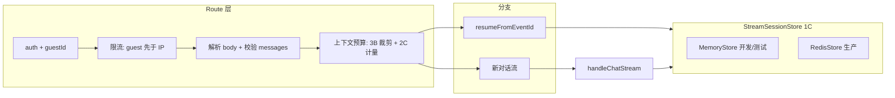

# 聊天增强（企业向）技术方案

本文档对应需求：[requirements.md](./requirements.md)。架构决策：**`1C, 2C, 3B, 4A`（实现顺序配合 `4C`）`, `5A`, `6A`**（见下文「关键架构决策」）。

---

## 1. 总体架构

请求进入 **`POST /api/chat`** 后的处理链路：



- **`StreamSessionStore`（1C）**：封装创建会话、按 `streamId` 读取、追加事件、标记完成/错误及 TTL；开发环境使用内存实现，生产环境使用 Redis，保证多实例下续传一致。
- **限流（4A + 4C）**：同一请求内**先**按 `guestId` 检查，**再**按客户端 IP 检查；任一失败返回 **429**，响应体中可区分 `RATE_LIMIT_USER` 与 `RATE_LIMIT_IP`。
- **上下文预算（2C + 3B）**：在调用模型前对 `messages` 处理；以**条数 + 字符**为基线，可选开启 tokenizer 精算；裁剪策略为**保留 system（若有）+ 最近 K 轮**，从最早可删轮次删除直至落入预算。
- **续传缓冲（5A）**：条数与字节双上限；超限时**从队列头部丢弃最旧事件**并记录结构化日志，再写入新事件。

---

## 2. 关键架构决策（与需求选项串对齐）

| 决策点 | 选项 | 说明 |
|--------|------|------|
| 会话存储 | **1C** | 抽象接口；内存与 Redis 两种实现可切换。 |
| Token/字符 | **2C** | 条数 + 字符为主；可选 tokenizer 提高与模型一致性。 |
| 裁剪策略 | **3B** | 保留系统提示与最近 K 轮，再删更早轮次。 |
| 限流 | **4A + 4C** | Redis 滑动窗口；**先用户、后 IP**。 |
| 缓冲顶满 | **5A** | 丢弃最旧事件，保证长流可继续。 |
| 可观测性 | **6A** | 结构化单行日志（字段约定见第 6 节）。 |

---

## 3. 技术选型与理由

| 领域 | 选型 | 理由 |
|------|------|------|
| 会话存储 | 接口 + `MemoryStreamSessionStore` + `RedisStreamSessionStore` | 本地零依赖开发、CI 可测、生产多实例一致。 |
| Redis 客户端 | `ioredis`（TCP）或 `@upstash/redis`（HTTP） | 由部署方式选择；通过工厂/环境变量注入，业务代码只依赖接口。 |
| 计量（2C） | 默认 UTF-8 **字符/字节**；可选 `js-tiktoken` / `gpt-tokenizer` | 先交付再精算，与模型族对齐时可开开关。 |
| 限流 | Redis **滑动窗口**（`INCR` + `PEXPIRE` 或 Lua） | 不绑定单一云厂商；用户与 IP 各一组 key。 |
| 日志（6A） | 固定字段的 JSON 单行输出 | 满足「可审计」最小集；后续可替换为 pino 或接入指标系统。 |

---

## 4. 性能考量

- **瓶颈**：Redis 往返、会话大对象序列化、`replayAndFollow` 轮询（当前为短间隔轮询）。
- **应对**：严格条数/字节双上限；会话 TTL 与流结束后清理一致；tokenizer 仅用于预算路径，不对每条 delta 重复计算。
- **后续优化（非本期必做）**：续传侧减少轮询（如阻塞读或通知机制），属实现细节。

---

## 5. 安全性考量

- 沿用 **NextAuth + `guestId`**；Resume 必须校验会话归属（与现逻辑一致）。
- Redis 中持久化的会话须含 **`guestId`**，加载后比对。
- **校验**：role 白名单、空消息、条数与长度；服务端为最终裁决。
- **限流**：降低滥用与撞库式刷接口；`X-Forwarded-For` 仅在信任反向代理时使用。
- **草稿**：长期存储不写密钥；登出清理与用户相关的 localStorage key（与前端约定）。

---

## 6. 可观测性（6A）字段约定

建议每条日志至少包含：`event`（如 `context_trimmed` | `buffer_drop_old` | `rate_limit`）、`guestId`、`streamId`（若有）、`reason` 或 `code`。便于日后接入集中日志或指标，无需改业务分支语义。

---

## 7. 可扩展性

- **`StreamSessionStore`**：可替换为集群 Redis 或加前缀的多租户方案。
- **预算**：`estimateSize` 与 `trimToBudget` 分离，便于调整 K、或未来接入摘要链路。
- **限流**：键模式 `ratelimit:user:{guestId}`、`ratelimit:ip:{hash}`，便于按租户调配额。

---

## 8. 模块划分（建议路径）

| 模块 | 职责 |
|------|------|
| `lib/chat/limits.ts` | 共享常量：消息条数、单条长度、总上下文、保留轮数、缓冲条数/字节 |
| `lib/chat/validateRequest.ts` | 校验请求体：role、非空、条数、单条长度 |
| `lib/chat/budget.ts` | 2C 计量 + 3B 裁剪 |
| `lib/chat/rateLimit.ts` | 4A + 4C：先用户后 IP |
| `lib/sseServer/streamSessionStore.ts` | 存储接口 |
| `lib/sseServer/streamSession.memory.ts` | 内存实现 |
| `lib/sseServer/streamSession.redis.ts` | Redis 实现 |
| `lib/observability/chatLog.ts` | 结构化日志封装 |

`app/api/chat/route.ts` 负责编排：**鉴权 → 限流 → 解析 → 校验 → 预算 → resume / handleChatStream**。

---

## 9. 对现有系统的影响

- **`ChatRequestBody`**：可选增加 `conversationId?: string`（草稿隔离与日志）；不传保持兼容。
- **SSE `id` 格式**：保持 `streamId:seq`，不改变前端协议。
- **`handleChatStream`**：通过注入的 `StreamSessionStore` 创建会话；消息列表改为经预算模块处理后的副本。
- **环境变量（实现阶段落地）**：`REDIS_URL` 或 Upstash 变量、限流窗口与阈值、`CHAT_TOKENIZER=0|1` 等。

---

## 10. 关键接口与数据结构草案（伪代码）

```ts
// lib/sseServer/streamSessionStore.ts
interface StreamSessionStore {
  create(guestId: string): Promise<StreamSession>;
  get(streamId: string): Promise<StreamSession | null>;
  appendEvent(
    streamId: string,
    ev: BufferedEvent,
    opts: { maxEvents: number; maxBytes: number }
  ): Promise<{ dropped: number }>;
  markDone(streamId: string): Promise<void>;
  markError(streamId: string): Promise<void>;
}

// lib/chat/budget.ts
type EstimateMode = "chars" | "tokens";
function estimateContext(messages: Message[], mode: EstimateMode): number;
function trimMessages(
  messages: Message[],
  policy: {
    maxContext: number;
    keepLastTurns: number;
    preserveSystem: boolean;
  }
): { messages: Message[]; removedCount: number };

// lib/chat/rateLimit.ts
async function assertChatRateLimit(req: NextRequest, guestId: string): Promise<void>;
// 429 体示例: { error: string, code: 'RATE_LIMIT_USER' | 'RATE_LIMIT_IP' }
```

---

## 11. 文档版本

| 日期 | 说明 |
|------|------|
| 2026-04-01 | 初版，对应架构决策 `1C,2C,3B,4A+4C,5A,6A` |
