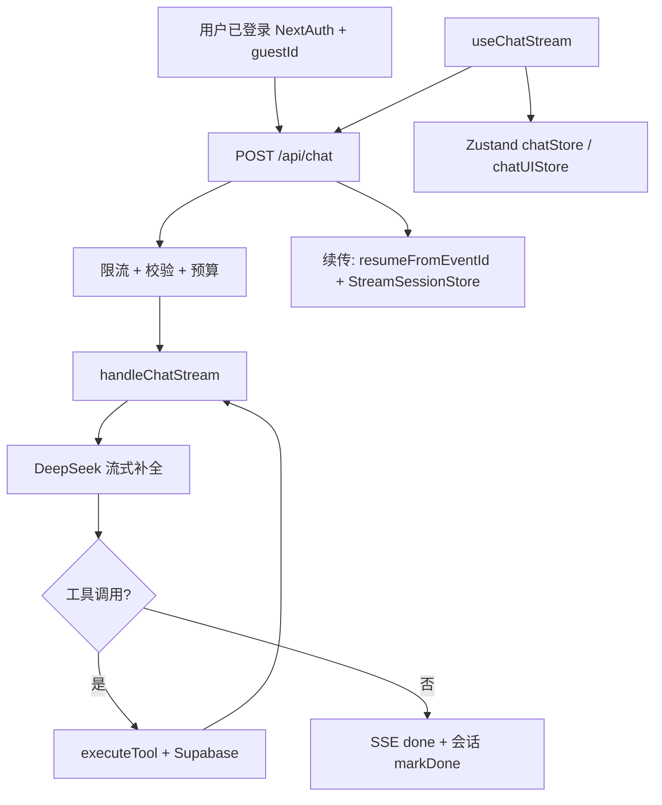

# 项目功能模块报告（AI 助手专项）

**项目名称**：the-wild-oasis-website（`package.json`）  
**项目类型**：Next.js 14 Web 应用（全站嵌入侧边聊天面板）  
**分析时间**：2026-04-08  

---

## 功能概览（一图看懂）

```
the-wild-oasis-website · AI 助手
├── 对话核心
│   ├── 流式对话（SSE：`thinking` / `delta` / `tool_call` / `done` / `error`）
│   ├── 模型：DeepSeek `deepseek-reasoner`（OpenAI 兼容流式协议）
│   └── 多轮工具调用（服务端最多 5 轮，防死循环）
├── 业务工具（Function Calling → Supabase）
│   ├── 查可用房间、创建预订、查/删我的预订、算价
│   └── guestId 服务端注入，防 prompt 越权
├── 可靠性与续传
│   ├── 服务端流会话缓冲 + `resumeFromEventId` 断点续传（Memory/Redis）
│   ├── 客户端指数退避重试 + 携带最后事件 id 续接
│   └── 中止生成（AbortController + 代际取消令牌）
├── 安全与配额
│   ├── NextAuth 会话 + `guestId` 校验（401/403）
│   ├── Redis 滑动窗口限流（用户优先、再按 IP；可 fail-open）
│   └── 消息条数/长度/上下文预算（可选启发式 token 裁剪）
└── 体验与展示
    ├── Zustand 多会话 + 状态机（idle / waiting / thinking / tool_calling / answering）
    ├── Markdown（GFM）+ 代码高亮；流式时 Markdown 自动补全
    ├── 输入草稿 localStorage（按会话；登出清理）
    └── 预订确认弹窗（`ChatBookingModal`）结构化触发 `create_booking`
```

---

## 功能详情

### 1. 对话与模型接入

| 子能力 | 作用 | 关键实现 |
|--------|------|----------|
| **流式回复** | 实时展示助手输出 | 服务端 `consumeLLMStream` 解析 DeepSeek/OpenAI 风格 `data:` 行，经 `formatSSE` 写出；客户端 `lib/sseClient/client.ts` + `useChatStream` 消费 |
| **推理链展示** | 展示 R1 类 `reasoning_content` | 服务端映射为 `thinking` 事件；`chatStore.appendThinking` 累积到当前 assistant |
| **模型提供方** | 调用外部 API | `lib/ai/provider.ts` → `https://api.deepseek.com/chat/completions`，`DEEPSEEK_API_KEY` |

**依赖**：环境变量 `DEEPSEEK_API_KEY`；用户须已登录且 session 含 `guestId`。

---

### 2. 工具调用与酒店业务集成

- **作用**：让模型在对话中查房、下单、管理预订、算价，而非仅文本回答。
- **关键实现**：
  - 工具 schema 与执行：`lib/sseServer/aiTools.ts`（`TOOL_DEFINITIONS` + `executeTool`）
  - 编排：`lib/sseServer/chatHandler.ts` — `streamChatCompletion` → `consumeLLMStream` → 有 `tool_calls` 则 `executeTool` 并把 `role: "tool"` 写回消息，最多 **5** 轮
- **安全设计**：`guestId` 仅由服务端 `ToolContext` 注入，工具内查询/写库都带 `guestId` 约束（如 `get_booking_detail`、`delete_booking` 防越权）。
- **依赖**：`@/lib/supabase` 访问 `cabins`、`bookings`、`settings` 等表。

---

### 3. API 路由与 SSE 会话

- **作用**：统一入口、鉴权、限流、校验、预算、新流与续传分支。
- **关键实现**：`app/api/chat/route.ts`
  - `POST`：401 未登录；429 限流；400 校验/预算；续传分支 `replayAndFollow`；新对话走 `handleChatStream`。
- **依赖**：`getStreamSessionStore()`（`lib/sseServer/streamSessionStore.ts`，可 memory/redis）、`lib/sseServer/streamSession.ts`（事件 id、`markDone`/`markError`）。

---

### 4. 前端状态与交互

| 子能力 | 作用 | 关键实现 |
|--------|------|----------|
| **多会话** | 多 tab 对话、标题取自首条用户消息 | `store/chatStore.ts` |
| **状态机** | UI 阶段与顶栏文案 | `lib/chat/stateMachine.ts` + `STATE_LABEL` |
| **发送/停止** | 流式请求、重试、401 回滚两条消息、停止标 `streamStopped` | `lib/sseClient/useChatStream.ts` |
| **面板 UI** | 全屏/收起、未登录提示、重连提示 | `store/chatUIStore.ts`、`components/chat/ChatPanel.tsx` |
| **内容渲染** | Markdown、表格、代码块 | `components/chat/MessageRenderer.tsx`（`remark-gfm`、`rehype-highlight`、`mdAutoClose`） |
| **预订弹窗** | 选人数/早餐/备注后拼消息再 `sendMessage` | `components/chat/ChatBookingModal.tsx` |

**入口**：`app/layout.js` 全局挂载 `<ChatPanel />`（非独立 `/chat` 页面为主入口）。

---

### 5. 限流、校验与上下文预算

- **限流**：`lib/chat/rateLimit.ts` — Redis Lua 滑动窗口；配置见 `lib/chat/limits.ts`（`CHAT_RATE_LIMIT_*` 等）。
- **请求体校验**：`lib/chat/validateRequest.ts`（新聊 vs `resume` 分支）。
- **上下文预算**：`lib/chat/budget.ts` — 超限时按轮裁剪；可选 `CHAT_TOKENIZER` 启发式 token。

---

### 6. 草稿与登出清理

- **作用**：刷新前保留输入框草稿；登出清除敏感本地草稿。
- **关键实现**：`lib/chat/chatDraftStorage.ts`；`lib/http/apiFetch.ts` / `SignOutButton` 调用 `clearAllChatDrafts`。

---

## 功能依赖关系图



---

## 缺失或可增强点（基于代码）

1. **对话持久化**：会话与消息主要在客户端 Zustand 内存中，刷新页面会丢失历史（除非另行扩展）。
2. **Markdown 安全**：当前 `MessageRenderer` 未使用 `rehype-sanitize`（项目已依赖 `rehype-sanitize`，可考虑对助手 HTML 输出做消毒）。
3. **多模态**：无图片/文件上传与视觉模型链路。
4. **可观测性**：已有 `chatLog` 等埋点模块，可按环境细化指标与告警。

---

## 建议阅读顺序（理解 AI 助手）

1. `app/api/chat/route.ts` — 入口与续传
2. `lib/sseServer/chatHandler.ts` + `consumeLLMStream.ts` — 流与工具循环
3. `lib/sseServer/aiTools.ts` — 业务工具
4. `lib/sseClient/useChatStream.ts` — 客户端重试与状态更新
5. `store/chatStore.ts` + `lib/chat/stateMachine.ts` — UI 状态

---

## 元信息说明

仓库根目录 `README.md` 仍为 Next.js 默认模板，项目定位以 `package.json` 名称与代码为准；AI 助手是 **The Wild Oasis** 站点上的 **DeepSeek 流式聊天 + 预订类工具调用 + SSE 续传与限流** 的一体化实现。

本文档由 **project-feature-analyzer** 工作流生成并人工校对路径与日期。
