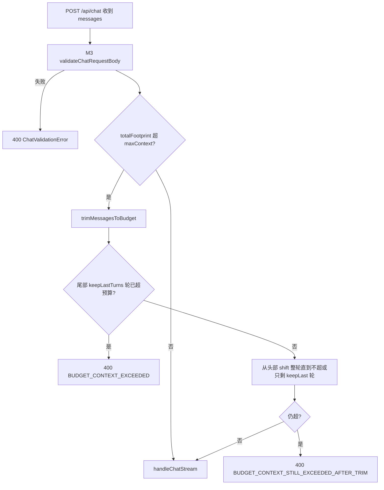

# 功能实现解析：对话上下文截断（上下文预算 M4）

## 功能概述

在服务端对发往 LLM 的 `messages` 做**总上下文计量与裁剪**：合并后的文本量（码点或启发式 token）超过 `CHAT_MAX_CONTEXT_CHARS` 时，**从对话最旧的「轮」开始整轮删除**，直到不超限，且保证至少保留最近 `CHAT_KEEP_LAST_TURNS` 轮；若**仅这若干轮就已超限**，则**拒绝请求**而非截断单条。用于控制成本、避免超长 prompt，并与 M3 的单条/条数上限形成双层约束。

## 代码位置

| 文件 | 职责 |
|------|------|
| `lib/chat/budget.ts` | 核心：`splitIntoTurns`、`trimMessagesToBudget`、`applyBudgetOrThrow`、`ChatBudgetError`；码点计数与启发式 token |
| `lib/chat/limits.ts` | `getChatLimits()`、`isTokenizerEnabled()`、`CHAT_ENV_KEYS`；默认与 env 覆盖 |
| `app/api/chat/route.ts` | `applyBudgetIfMessagesPresent`：在校验通过后替换 `body.messages` |
| `lib/chat/validateRequest.ts` | M3：条数、单条长度、角色（先于预算执行） |
| `lib/observability/chatLog.ts` | `context_trimmed` / `context_rejected` 等可观测性事件 |

**说明**：客户端 `lib/sseClient/useChatStream.ts` 中的 `buildApiMessagesForRequest` 只做过滤与「连续 user 桥接」，**不属于**服务端上下文预算。

## 核心流程



**与限流顺序**：`assertChatRateLimit` → `req.json()` → M3 校验 → M4 预算 → `handleChatStream`（限流在 body 之前）。

## 关键函数 / 类

### `splitIntoTurns(messages: Message[]): Message[][]`

- **作用**：以 **`user` 为新轮起点**；遇到 `user` 且当前轮非空时，把上一轮 `push` 进 `turns`，再开启新轮。首条若为 `assistant`，会与后续直到第一个 `user` 之前的消息同属第一轮（实现上全部 `push` 进 `current`）。
- **输出**：`Message[][]`，每一子数组为一轮。

### `trimMessagesToBudget(messages, policy)`

- **输入**：`messages`；`policy.maxContextChars`（token 模式下仍为同一字段名，表示预算上限单位）、`keepLastTurns`、`measureMode` 可选。
- **逻辑**：
  1. `tail = turns.slice(-keepLast)`，若 `tail` 总 footprint **>** `maxUnits` → `ChatBudgetError("BUDGET_CONTEXT_EXCEEDED")`。
  2. 否则 `while (working.length > keepLast && total > maxUnits) working.shift()`，整轮丢弃。
  3. 扁平化后若仍超 → `BUDGET_CONTEXT_STILL_EXCEEDED_AFTER_TRIM`。
  4. 有删除则 `chatLog('info', 'context_trimmed', …)`。
- **输出**：`{ messages, removedCount, trimmed }`。

### `applyBudgetOrThrow(messages, { mode })`

- **作用**：总 footprint ≤ 上限则直接返回；否则调用 `trimMessagesToBudget`，再二次校验。
- **与 route**：`applyBudgetIfMessagesPresent` 根据 `isTokenizerEnabled()` 选 `mode: 'chars' | 'tokens'`。

### `messageFootprint` / `totalFootprint`（内部）

- 对每条消息只计量 **`content` + `thinking`** 拼接串（见 `budget.ts`）。**`toolCalls` 未计入**当前 footprint，与真实发给模型的 token 可能不一致。

## 数据流

```
用户侧会话（chatStore 全量 messages）
    → useChatStream 构建请求体（过滤、桥接）
    → POST /api/chat JSON
    → validateChatRequestBody（条数、单条长度）
    → applyBudgetOrThrow（可能删减头部整轮）
    → handleChatStream(initialMessages) → LLM
```

服务端裁剪后的列表**不会回写客户端**；客户端仍保留完整 UI 历史，仅当次请求使用裁剪后的上下文。

## 状态管理

本功能**无独立全局状态**：纯服务端对请求体的变换。会话消息仍由 `store/chatStore.ts` 等维护；截断只影响**单次 API 调用**的 payload。

## 依赖关系

| 依赖 | 用途 |
|------|------|
| `lib/chat/limits` | 上限与 `CHAT_TOKENIZER` |
| `lib/observability/chatLog` | 结构化日志 |
| `@/types/chat` `Message` | 角色与 content/thinking |

无第三方 tokenizer 库；启发式 token 为内置 `estimateTokensApprox`。

## 设计亮点

1. **按轮删除**：保留对话交替语义，避免在单条消息中间截断导致模型读到残缺指令。
2. **尾部硬约束**：先检查「最近 N 轮」是否已爆预算，直接拒绝，避免无意义的大量 shift。
3. **双模式计量**：默认零依赖码点；生产可开 `CHAT_TOKENIZER` 用近似 token 对齐计费心智。
4. **与 M3 分层**：单条上限 + 总预算，防止「很多条略低于单条上限但总和巨大」的绕过。

## 潜在问题 / 改进点

1. **`toolCalls`（尤其长 JSON 参数/结果）未计入** `messageFootprint`，极端情况下预算通过但实际发往模型的体积仍很大。
2. **`preserveSystem` 仅占位**：当前 `Message.role` 仅 `user` | `assistant`（见 `types/chat.ts`），若未来引入 `system`，需实现与 `splitIntoTurns` 的协调。
3. **启发式 token** 与真实模型 tokenizer 偏差可能较大；高精度场景可替换为 tiktoken 等并集中封装在 `messageFootprint`。
4. **客户端无「已截断」提示**：用户不知道服务端丢了早期轮次，如需产品化可让 API 返回 header 或字段声明 `trimmed: true`（当前未实现）。

---

## 面试总结（STAR）

**Situation（场景）**  
聊天会话变长后，单次请求携带完整 `messages` 会导致 API 成本高、延迟大，甚至触发模型上下文上限；需要在网关侧可控地限制合并上下文。

**Task（任务）**  
在不大改前端的前提下，在 **`POST /api/chat`** 统一做上下文预算：可裁剪时按业务可接受的粒度丢弃旧内容；不可裁剪时明确失败并带错误码。

**Action（行动）**

- 在 `lib/chat/budget.ts` 实现 **按 user 分轮**、**保留最近 `keepLastTurns` 轮**、**从头部整轮删除**直至低于 `CHAT_MAX_CONTEXT_CHARS`（或 tokenizer 模式下的等价单位）。
- 通过 `lib/chat/limits.ts` 的 **策略 B（常量 + env）** 暴露 `CHAT_MAX_CONTEXT_CHARS`、`CHAT_KEEP_LAST_TURNS`、`CHAT_TOKENIZER`，便于环境差异化配置。
- 在 `route.ts` 中把 **M4 放在 M3 校验之后**，与 **`chatLog`** 联动记录 `context_trimmed` / `context_rejected`，便于监控与排障。

**Result（结果）**

- 服务端对每次对话请求有**确定性的上下文上限**与**可观测的裁剪/拒绝**路径；与 M3 单条/条数限制组合，形成多层输入治理。量化效果依赖线上 env 与模型选型，可通过日志中的 `context_trimmed` 次数与 400 `BUDGET_*` 比例评估调参。

---

## 相关文档

- 流程向说明（时序、env 表）：[`feature-flow-context-budget.md`](./feature-flow-context-budget.md)
- 设计总览：[`design-m1-m4.md`](./design-m1-m4.md) 第 5 节 M4
