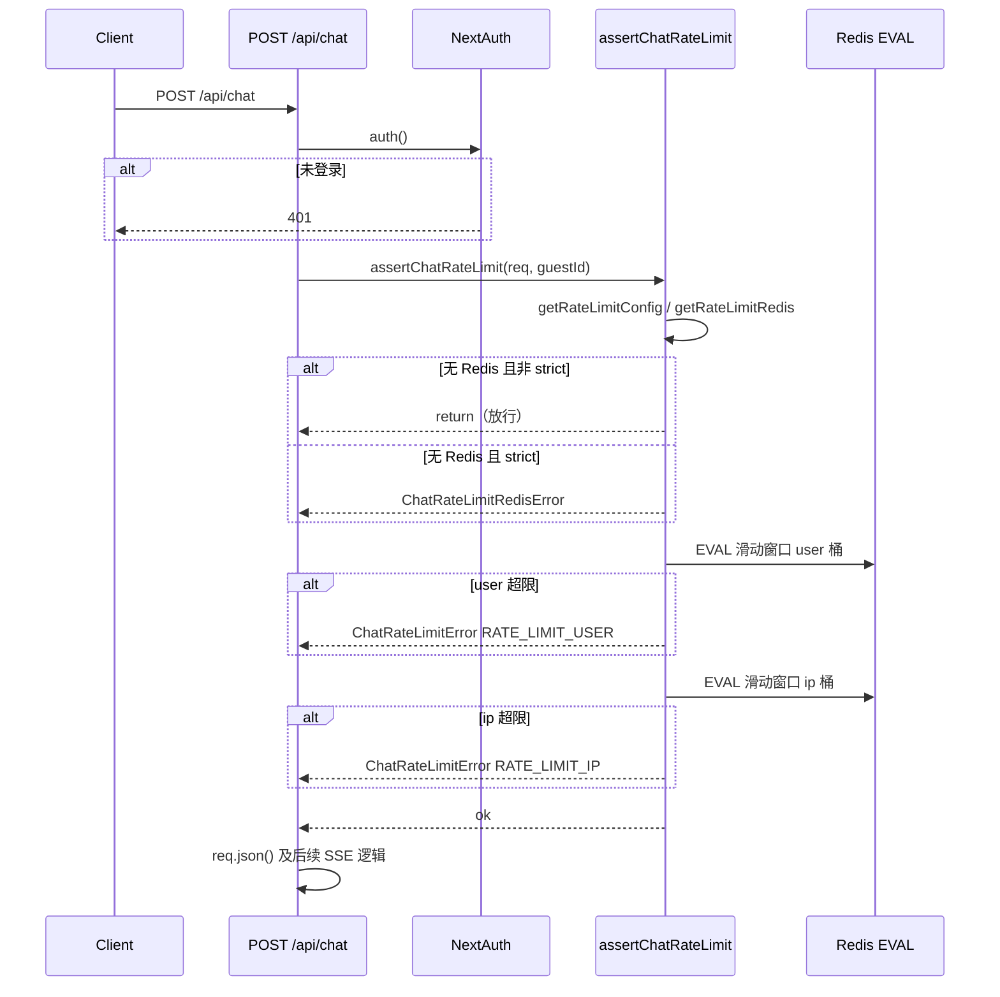

# 功能实现解析：聊天 API 限流（M5）

> **相关文档**：[技术设计](./design-m5-rate-limit.md) · [实现总结](./implementation-summary-m5.md) · [验收](./acceptance-m5.md)

## 功能概述

在已登录用户调用 `POST /api/chat` 时，使用 **Redis + Lua 滑动窗口** 限制请求频率：先按 **访客（guestId）** 计数，再按 **客户端 IP（哈希后）** 计数，减轻单用户刷接口与单 IP 滥用；Redis 不可用时默认 **放行（fail-open）**，可选 **严格模式** 下返回 **503**，避免在无法计数时默默放开。

## 代码位置

| 文件 | 职责 |
|------|------|
| `lib/chat/rateLimit.ts` | 核心：`assertChatRateLimit`、Lua 脚本、IP 解析与哈希、错误类型 |
| `lib/chat/limits.ts` | `getRateLimitConfig()`、`RATE_LIMIT_ENV_KEYS`、默认窗口与配额 |
| `lib/redis/getRateLimitRedis.ts` | 按环境懒加载单例：Upstash REST / ioredis |
| `lib/redis/rateLimitRedis.ts` | 仅暴露 `eval` 的抽象接口 |
| `lib/redis/ioredisRateLimit.ts` | TCP Redis（`REDIS_URL`）适配 |
| `lib/redis/upstashRateLimit.ts` | Upstash REST 适配（Serverless 友好） |
| `app/api/chat/route.ts` | 在解析 body **之前** 调用限流，映射 429 / 503 |
| `lib/observability/chatLog.ts` | 结构化日志（`rate_limit`、`redis_unavail`） |
| `lib/sseClient/retryPolicy.ts` | 客户端将 **429 视为可重试** |
| `scripts/m5-acceptance.ts` | 验收脚本 |

## 核心流程

**要点**：限流发生在 `req.json()` **之前**；**resume（`resumeFromEventId`）与新对话共用同一套配额**（每次 `POST` 计 1 次）。

## 关键函数 / 类

### `assertChatRateLimit(req, guestId)`（`lib/chat/rateLimit.ts`）

- **输入**：`NextRequest`、会话中的 `guestId`。
- **逻辑概要**：
  - 读取 `getRateLimitConfig()`、`getRateLimitRedis()`。
  - 无 Redis：`strict` → 抛 `ChatRateLimitRedisError`；否则打 warn 日志并 **直接返回**（fail-open）。
  - `resolveClientIp` + `hashIp` → `ratelimit:ip:<16 位 hex>`；用户桶为 `ratelimit:user:<guestId>`。
  - 依次对用户桶、IP 桶调用 `consumeSlot`（内部 `redis.eval` 执行 Lua）。
  - 任一桶失败 → 抛 `ChatRateLimitError(code, retryAfterMs)`。
  - `eval` 抛错：`strict` → `ChatRateLimitRedisError`；否则 warn 后 **吞掉异常**（fail-open）。

### Lua 滑动窗口（`LUA_SLIDING_WINDOW`）

- 使用 **ZSET**：score 为时间戳；先 `ZREMRANGEBYSCORE` 清理窗口外记录；若当前条数 ≥ `limit`，根据最老元素计算 **`retryAfterMs`**，返回 `{0, retryAfter}`；否则 `ZADD` 新 member，`PEXPIRE` 键。

### `getRateLimitConfig()`（`lib/chat/limits.ts`）

- 默认：`windowMs = 60_000`，`userMax = 60`，`ipMax = 120`，`trustProxy = false`，`strict = false`；均可由环境变量覆盖。

### Route 中的 HTTP 映射（`app/api/chat/route.ts`）

- `ChatRateLimitError` → **429**，JSON：`{ error, code }`，响应头 **`Retry-After`**（秒，`ceil(retryAfterMs/1000)`，最小 1）。
- `ChatRateLimitRedisError` → **503**，`code: REDIS_UNAVAILABLE`。

## 数据流

- **无全局前端状态**：限流仅在 **Route Handler + Redis** 完成。
- **Redis 键**：`ratelimit:user:${guestId}`、`ratelimit:ip:${sha256(ip).slice(0,16)}`。
- **member**：`${Date.now()}-${random}`，避免同毫秒冲突。

## 环境变量

| 变量 | 作用 |
|------|------|
| `CHAT_RATE_LIMIT_WINDOW_MS` | 滑动窗口长度（默认 60000） |
| `CHAT_RATE_LIMIT_USER_MAX` | 每窗口每用户最大请求数（默认 60） |
| `CHAT_RATE_LIMIT_IP_MAX` | 每窗口每 IP 最大请求数（默认 120） |
| `TRUST_PROXY` | 为 `1`/`true` 时优先用 `X-Forwarded-For` 第一段作为 IP |
| `CHAT_RATE_LIMIT_STRICT` | Redis 缺失或 `eval` 失败时是否返回 503 |
| `REDIS_DRIVER` | `upstash` / `ioredis`（可选；亦可自动探测） |
| `REDIS_URL` / `UPSTASH_REDIS_REST_URL` + `UPSTASH_REDIS_REST_TOKEN` | Redis 连接 |

会话存储相关 `CHAT_SESSION_*` 与限流窗口 **独立**（见 `lib/chat/limits.ts` 注释）。

## 依赖关系

- **Node**：`crypto`（SHA256）、`next/server`（`NextRequest`）。
- **Redis**：`ioredis` 或 `@upstash/redis`，统一为 `RateLimitRedis.eval`。
- **观测**：`chatLog`（不记录用户消息正文）。

## 设计亮点

1. **原子性**：Lua 内完成裁剪 + 计数 + 拒绝时 `retryAfterMs`，减少竞态。
2. **双桶**：用户 + IP；用户桶先失败则 **短路**，少一次 Redis 往返（与设计一致）。
3. **隐私**：IP 仅存短哈希。
4. **性能**：限流在解析 JSON 之前，超限请求不浪费 body 解析。
5. **运维**：默认 fail-open；生产可开 strict。
6. **客户端**：`isRetryableChatError` 将 429 标为可重试；是否与响应头 **`Retry-After` 对齐等待** 取决于 `lib/sseClient` 实现，可单独评审。

## 潜在问题 / 改进点

- **非 strict 且 Redis 宕机**：会完全不限流，宜配合网关/WAF 或尽快恢复 Redis。
- **`TRUST_PROXY`**：若部署在不可信代理前误开，可能伪造 `X-Forwarded-For` 绕过 IP 桶。
- **续传与新聊共用计数**：频繁断线重连可能更快触顶，需与产品预期一致。

---

## 面试总结（STAR）

**Situation**：聊天为 SSE/长请求，成本与滥用风险高；部署可能为 Serverless，Redis 常选 REST（Upstash）。

**Task**：在 `/api/chat` 上实现可配置、可观测的限流；Redis 异常时策略明确（放行或 503）。

**Action**：Redis ZSET **滑动窗口 + Lua**；**先 user 后 IP**；`RateLimitRedis` **双驱动**；**strict / fail-open**；**429 + Retry-After**；`chatLog` + `scripts/m5-acceptance.ts`。

**Result**：单入口保护新聊与续传；客户端策略层视 429 为可重试，便于自动恢复。

---

*文档版本：与仓库实现同步维护；代码以 `lib/chat/rateLimit.ts`、`app/api/chat/route.ts` 为准。*
