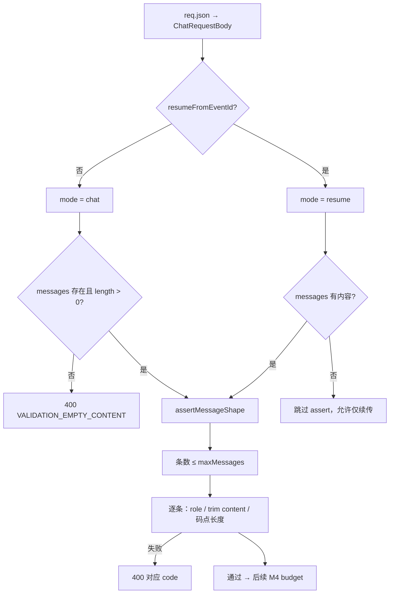

# 功能实现解析：单条 / 条数上限（M3 + M1）

## 功能概述

在 **`POST /api/chat`** 解析请求体后、做上下文预算（M4）之前，对 `messages` 做**结构化校验**：限制数组**条数**、每条 **`user`/`assistant` 角色**、**非空正文**，以及单条 **`content` 的 Unicode 码点长度**上限。上限值由 **M1** `getChatLimits()` 提供（默认常量 + `process.env` 覆盖）。用于拒绝畸形或过大的单次请求，并与 **M4 总上下文预算**分层配合。

## 代码位置

| 文件 | 职责 |
|------|------|
| `lib/chat/validateRequest.ts` | **`validateChatRequestBody`**、`assertMessageShape`、`ChatValidationError` |
| `lib/chat/limits.ts` | **`getChatLimits()`**、`CHAT_ENV_KEYS`、`DEFAULTS`（`maxMessages`、`maxMessageChars`）、`ChatErrorCode` |
| `app/api/chat/route.ts` | 在 `req.json()` 之后调用校验；`resume` 与 `chat` 两种 mode |
| `types/chat.ts` | `ChatRequestBody`、`Message`（`role` 等） |

## 核心流程



**顺序（与截断关系）**：认证 → 限流 → **`validateChatRequestBody`（M3）** → **`applyBudgetIfMessagesPresent`（M4）** → 流式处理。

## 关键函数 / 类

### `validateChatRequestBody(body, mode: 'chat' | 'resume')`

| mode | 行为 |
|------|------|
| **`chat`** | 要求 `body.messages` 存在且 **`length > 0`**；否则 `VALIDATION_EMPTY_CONTENT`（message: `"messages is required"`）。随后 **`assertMessageShape`**。 |
| **`resume`** | 若 **`messages` 缺失或空数组**，**不**调用 `assertMessageShape`（允许只带 `resumeFromEventId` 续传）。若带了非空 `messages`，则与 `chat` 一样走 **`assertMessageShape`**。 |

### `assertMessageShape(body, limits)`

在 `messages?.length` 为假时直接返回（空数组不进入下方逻辑——由上层 `chat` mode 已拦截）。

1. **`messages.length > limits.maxMessages`** → `ChatValidationError("VALIDATION_TOO_MANY_MESSAGES")`。
2. 对每条消息：
   - **`role`** 必须是 **`user` 或 `assistant`** → 否则 `VALIDATION_INVALID_ROLE`。
   - **`text = (m.content ?? "").trim()`**；若 `text` 为空 → `VALIDATION_EMPTY_CONTENT`（**仅看 content**，不含 `thinking`）。
   - **`len = [...text].length`**（码点长度，与 `budget.ts` 中 `countCodePoints` 语义一致）；若 **`len > limits.maxMessageChars`** → `VALIDATION_MESSAGE_TOO_LONG`。

### `getChatLimits()`（`lib/chat/limits.ts`）

- **`maxMessages`**：`CHAT_MAX_MESSAGES`，默认 **100**，`parsePositiveInt`，非法 env 回退默认并可选 `chatLog('warn', 'env_parse_failed', …)`。
- **`maxMessageChars`**：`CHAT_MAX_MESSAGE_CHARS`，默认 **16000**。

### `ChatValidationError`

- 继承 `Error`，带 **`readonly code: ChatErrorCode`**。
- Route 捕获后返回 **400**，JSON：`{ error: err.message, code: err.code }`。

## 数据流

```
客户端构造 messages[]
    → POST /api/chat
    → validateChatRequestBody（条数、每条 content 长度/非空、role）
    → 通过则 applyBudgetOrThrow（总上下文，另一套上限）
    → handleChatStream
```

M3 只约束**请求里出现的消息数组**；不修改数组内容（与 M4 可能删减头部不同）。

## 状态管理

无全局状态；校验为**纯函数式**检查，失败即短路返回 400。

## 依赖关系

| 依赖 | 用途 |
|------|------|
| `getChatLimits` | 读取条数、单条长度上限 |
| `ChatRequestBody` / `Message` | 请求形状与 role 类型 |

无第三方校验库。

## 设计亮点

1. **`chat` / `resume` 分 mode**：续传可不带 `messages`，避免误杀纯续传请求。
2. **码点长度**：与 M4 `budget` 层对字符串长度的计量方式对齐（注释写明「与 budget 一致」），减少「校验通过但预算语义不一致」的歧义。
3. **策略 B**：上限集中在 `limits.ts`，运维可通过 env 调参而无需改业务代码。
4. **与 M4 分层**：先限制「单条多大、多少条」，再限制「合并后总多少」——防止大量中等长度消息堆叠绕过单条限制（总预算仍会拦，但条数上限减轻攻击面与解析成本）。

## 潜在问题 / 改进点

1. **`thinking` 不参与 M3 长度校验**：若客户端把大量文本放在 `thinking` 而 `content` 很短，可能通过单条长度检查；M4 的 `messageFootprint` **会**把 `content + thinking` 算进总上下文，但若总上下文未超、单条 `content` 合规，仍可能把超长 `thinking` 送进下游——需否在 M3 或合并字段上统一约束，取决于产品定义。
2. **`toolCalls` 未在校验阶段展开**：条数只数 `messages` 条数，不数工具调用个数；大 `arguments` 字符串主要依赖 M4 总预算（且 footprint 对 toolCalls 的覆盖见 M4 文档说明）。
3. **错误信息**：部分错误直接用 `code` 作默认 `message`，前端需根据 `code` 做 i18n 友好文案。

---

## 面试总结（STAR）

**Situation（场景）**  
开放聊天 API 若不对请求体做边界约束，容易被超大数组、超长单条或非法 role 拖垮解析与下游模型，需要网关层快速、确定性地拒绝。

**Task（任务）**  
在 Route Handler 内对 `messages` 做**条数**与**单条 content** 的硬上限，并与 env 配置联动；续传场景不能误伤「无 messages」的合法请求。

**Action（行动）**

- 在 **`validateRequest.ts`** 实现 **`assertMessageShape`**：条数、`user`/`assistant`、trim 后非空、码点长度。
- 在 **`limits.ts`** 用 **`parsePositiveInt`** 解析 **`CHAT_MAX_MESSAGES`**、**`CHAT_MAX_MESSAGE_CHARS`**，与 M4 共用同一套 **`getChatLimits()`** 入口。
- **`validateChatRequestBody`** 区分 **`chat` / `resume`**：新对话强制有 messages；续传仅在携带 messages 时校验形状。

**Result（结果）**  

- 单次请求在**进入 LLM 前**即被结构化约束，失败统一 **400 + `code`**，便于监控与客户端处理。与 M4 组合形成「条数 × 单条 × 总和」的多层治理。

---

## 相关文档

- 总上下文预算（M4）：[`feature-explainer-context-budget.md`](./feature-explainer-context-budget.md)、[`feature-flow-context-budget.md`](./feature-flow-context-budget.md)
- M1–M4 设计摘要：[`design-m1-m4.md`](./design-m1-m4.md) 第 4 节（M3）、第 2 节（M1）
