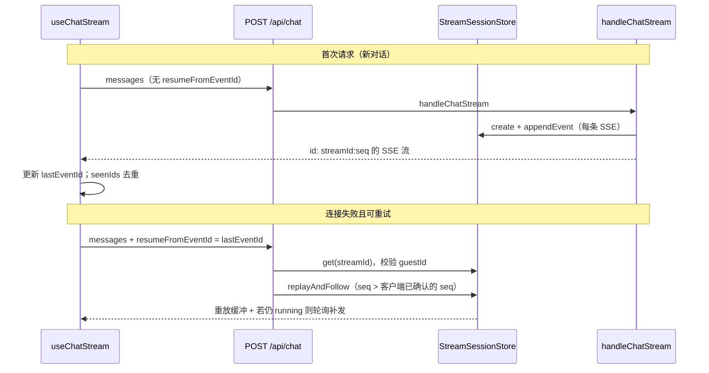

# 功能实现解析：聊天 SSE 断点续传

## 功能概述

在 **流式对话（SSE）** 过程中，若连接中断或流未正常结束，客户端在可重试场景下 **带上上次收到的 SSE `id` 再次请求**，服务端从 **会话缓冲** 中 **重放尚未消费的事件**；若生成仍在进行，则 **轮询跟随** 直至会话结束。这样用户无需重新发整条消息即可接上进度。

## 代码位置

| 文件 | 职责 |
|------|------|
| `types/chat.ts` | `ChatRequestBody.resumeFromEventId` 类型约定 |
| `lib/chat/validateRequest.ts` | `resume` 模式校验（可无 `messages`，有则校验形状） |
| `app/api/chat/route.ts` | 认证、限流、预算；**续传分支** 调用 `replayAndFollow` |
| `lib/sseServer/streamSession.ts` | `parseEventId`、`createSSEWriter`、`replayAndFollow` |
| `lib/sseServer/streamSessionStore.ts` | `StreamSessionStore` 契约、`getStreamSessionStore()` 单例与 **内存 / Redis 选型** |
| `lib/sseServer/streamSession.memory.ts` | M7：进程内 `MemoryStreamSessionStore`（默认） |
| `lib/sseServer/streamSession.redis.ts` | M8：`RedisStreamSessionStore`，键前缀 `stream:session:` |
| `lib/redis/sessionRedisFactory.ts` | `getSessionRedisForStore()`：解析 Redis 连接（无连接则返回 `null`） |
| `lib/chat/limits.ts` | `getSessionStoreKind()`、`SESSION_STORE_ENV_KEYS`（`CHAT_SESSION_STORE` 等） |
| `lib/sseServer/chatHandler.ts` | 新流：`createStreamSession`、经 `writeSSE` 缓冲；结束 `markSessionDone` |
| `lib/sseServer/formatSSE.ts` | 每条 SSE 带 `id:` 行 |
| `lib/sseClient/parser.ts` | 解析 `id:` → `SSEEvent.id` |
| `lib/sseClient/client.ts` | 流未收到 `done` 时抛 `SSEIncompleteError`（触发可重试） |
| `lib/sseClient/retryPolicy.ts` | 可重试错误判定（含 `SSEIncompleteError`） |
| `lib/sseClient/useChatStream.ts` | **维护 `lastEventId`、重试循环、`seenIds` 去重** |

## 核心流程



**步骤简述**

1. **新对话**：`handleChatStream` 创建 `StreamSession`，每条经 `writeSSE` 递增 `seq`，格式 `id: ${streamId}:${seq}`，并 `appendEvent` 到 store；能写则推给当前 HTTP writer，写失败则 **仅缓冲**（供续传）。
2. **客户端**：每收到带 `event.id` 的事件，更新 `lastEventId`，并加入 `seenIds` 防重复。
3. **失败重试**（`round > 0`）：若 **没有** `lastEventId`，无法续传，展示固定文案并进入 ERROR。
4. **续传请求**：body 为 `{ messages, resumeFromEventId: lastEventId }`。
5. **服务端**：`parseEventId` 拆出 `streamId` 与 **已收到的序号 `seq`**；校验会话存在、`guestId` 一致；`replayAndFollow(store, streamId, parsed.seq, ...)` 重放 **`ev.seq > watermark`** 的事件；若 `status === "running"`，每 50ms 轮询直到 `done`/`error`。

## 关键函数 / 逻辑

### `parseEventId(resumeFromEventId)`（`lib/sseServer/streamSession.ts`）

- 用 **最后一个 `:`** 分割（`streamId` 为不含 `:` 的 UUID，`seq` 在右侧）。
- 返回 `{ streamId, seq }` 或 `null`。

### `createSSEWriter` → `writeSSE`

- 每次写入：`session.seq += 1`，`id = \`${streamId}:${seq}\``，`formatSSE` 带 `id`，再 `store.appendEvent`（受 `maxEvents` / `maxBytes` 限制），最后尝试 `writer.write`。

### `replayAndFollow`

- `watermark` 从 `lastSeqExclusive`（即客户端上次确认的 `seq`）开始。
- 对 `session.events` 中 `ev.seq > watermark` 的项写入响应；若 `session.status === "running"` 且本轮没有新事件，**`setTimeout(50)`** 再读；直到非 `running` 或 `signal` 中止。

### `useChatStream` 内重试

- `MAX_RETRY_ROUNDS = 5`；`round === 0` 仅发 `messages`；`round > 0` 且存在 `lastEventId` 时附加 `resumeFromEventId`。
- `handleEvent`：若 `useResume` 且首包到达，清除 `streamReconnecting` UI 标志。
- `event.id`：**去重**后更新 `lastEventId`。

### `fetchSSE`（`lib/sseClient/client.ts`）

- 正常结束须收到 `event: done`；否则 `SSEIncompleteError` → `retryPolicy` 中视为可重试（断点续传场景）。

## 数据流

```text
服务端生成 SSE
  → formatSSE(type, data, id)
  → StreamSessionStore.appendEvent({ seq, id, sse })
  → 可选：WritableStream 推给浏览器

浏览器 parseSSEEvent
  → SSEEvent.id
  → lastEventId 更新；seenIds 防重

断线重试
  → POST { messages, resumeFromEventId: "uuid:seq" }
  → replayAndFollow 重放 seq > 该 seq 的缓冲 SSE 字符串
```

## 状态管理

- **服务端**：`StreamSession.status`：`running` | `done` | `error`（`chatHandler` 成功路径 `markSessionDone`，异常 `markSessionError`）。
- **客户端**：`chatStore` 管消息与状态机；`chatUIStore` 的 `streamReconnecting`、Abort、`streamCancelGeneration` 与续传/取消协同。

## 依赖关系

- **Next.js Route Handler**、`TransformStream` 返回 SSE 响应。
- **会话缓冲**：由 `getStreamSessionStore()` 注入，实现可能是内存或 Redis（**详见下一节**）。
- **`getBufferLimits()`**：缓冲上限，超限可能 **丢弃** 旧事件（对「超长会话续传」有影响）。

## 会话存储后端：内存与 Redis（选型与回退）

续传依赖服务端能按 `streamId` 取回未消费事件；**实现上两种后端都有**，运行时只选其一。

### 实现类

| 实现 | 文件 | 说明 |
|------|------|------|
| 内存 | `lib/sseServer/streamSession.memory.ts` | 进程内 Map，单实例可用；多实例 / 负载均衡下续传可能打到无会话的副本 → `Session expired`。 |
| Redis | `lib/sseServer/streamSession.redis.ts` | 跨进程共享；键前缀与限流键隔离；带 TTL（与 `CHAT_SESSION_TTL_MS` 等配置相关）。 |

### 如何选择：`getStreamSessionStore()`

逻辑在 `lib/sseServer/streamSessionStore.ts`：

1. **`getSessionStoreKind()`**（`lib/chat/limits.ts`）：仅当环境变量 **`CHAT_SESSION_STORE=redis`**（大小写不敏感）时为 Redis；**未设置或其它值一律视为 `memory`**。
2. 若 kind 为 `redis`，调用 **`getSessionRedisForStore()`**（`lib/redis/sessionRedisFactory.ts`）获取连接：
   - **优先** `CHAT_SESSION_REDIS_URL`（专用会话 Redis）；
   - 否则按 `REDIS_DRIVER`、`UPSTASH_REDIS_REST_*`、`REDIS_URL` 等解析（与 M5 限流可共用同一实例）。
3. **若声明了 Redis 但工厂返回 `null`（无可用连接）**：打告警日志（如 `session_store_redis_missing`），**回退为 `MemoryStreamSessionStore`**，不会阻塞启动。

因此：**默认运行时是纯内存**；只有同时满足「`CHAT_SESSION_STORE=redis`」且「能解析出 Redis 连接」才会走 Redis 实现。

### 环境变量速查

| 变量 | 作用 |
|------|------|
| `CHAT_SESSION_STORE` | `memory`（默认）或 `redis`；非法值当 `memory`。 |
| `CHAT_SESSION_REDIS_URL` | 可选；仅会话存储用，优先于共用 `REDIS_URL`。 |
| `CHAT_SESSION_TTL_MS` | 会话数据 TTL（毫秒），用于 Redis `EXPIRE`；与限流窗口独立。 |
| `REDIS_URL` / `REDIS_DRIVER` + Upstash | 未设专用 URL 时，工厂按现有规则选用 ioredis 或 Upstash。 |

生产多副本要稳定续传，需 **`CHAT_SESSION_STORE=redis` 且配置可用 Redis**；仅本地开发不配 Redis 时保持默认内存即可。

## 设计亮点

1. **SSE 标准 `id` 字段**：与「Last-Event-ID」思路一致，客户端用最后一次 `id` 作为游标。
2. **生成与推送解耦**：写失败不丢事件，只关 writer，缓冲仍在 store，适合弱网。
3. **客户端去重**：续传可能重复投递时，`seenIds` 保证 UI/状态机不重复处理。
4. **可重试错误集合明确**：网络、超时、5xx、429、`SSEIncompleteError` 等会进入重试；401/403/用户 Abort 不重试。

## 潜在问题 / 改进点

1. **缓冲裁剪**：`appendEvent` 在事件数/字节超限时可能 **丢弃** 较早事件，若客户端 `resumeFromEventId` 过旧，可能无法完整重放（需结合产品策略或调大限制）。
2. **多节点**：进程内内存 store 时，续传请求若落到 **另一实例** 会 **404 Session expired**；生产多副本应启用 **Redis 后端**（见上文「会话存储后端」）。
3. **`replayAndFollow` 与 Abort**：路由里未向 `replayAndFollow` 传入 `req.signal`，客户端断开时后台任务仍会写到 `writer` 直至结束（若需省资源可绑 `AbortSignal`）。
4. **首包前断线**：若尚未收到任何带 `id` 的事件，`lastEventId` 为空，**无法续传**（当前会提示用户重发）。

## 补充说明

- **续传请求**虽可带 `messages`（客户端在重试时会带上），但 `app/api/chat/route.ts` 的续传分支 **仅根据 `resumeFromEventId` 做重放**，未用 `messages` 做额外一致性校验。若需要服务端比对上下文防篡改，需另行设计。

## 面试总结（STAR）

| 维度 | 内容 |
|------|------|
| **Situation** | 流式 AI 对话弱网、超时频繁，用户不希望每次从头生成。 |
| **Task** | 在不大改协议的前提下，实现服务端可重放 + 客户端自动重试续传。 |
| **Action** | SSE 每条带 `streamId:seq`；服务端会话缓冲 + `replayAndFollow`；客户端维护 `lastEventId`、指数退避重试、`seenIds` 去重；可重试错误与 401/Abort 分流。 |
| **Result** | 连接中断后可从上次事件继续展示，减少重复生成与糟糕体验（量化指标依赖线上统计）。 |
