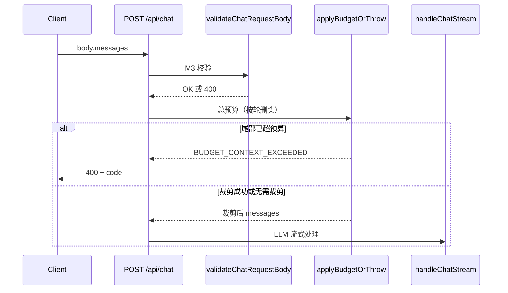

# 对话上下文预算与截断（M4）详细实现流程

> 与 [design-m1-m4.md](./design-m1-m4.md) 中 **M4** 一致；由 feature-flow-designer 技能基于代码整理生成。

## 功能概述

在 **`POST /api/chat`** 中，于校验通过之后、调用 LLM 流式处理之前，对请求体中的 `messages` 做**总上下文预算**：未超限时原样转发；超限时**从对话头部按「轮」删除**旧消息，使总量落在配置上限内。若**仅保留尾部若干轮仍超限**，或**尾部单独已超限**，则拒绝请求并返回明确错误码，避免超长上下文与不可控成本。

## 相关代码位置

| 职责 | 路径 |
|------|------|
| 预算与裁剪算法 | `lib/chat/budget.ts` |
| 默认上限与 env 键 | `lib/chat/limits.ts` |
| 接入点（调用顺序） | `app/api/chat/route.ts` |
| 条数 / 单条长度校验（先于预算） | `lib/chat/validateRequest.ts` |
| 结构化日志 | `lib/observability/chatLog.ts`（`context_trimmed` / `context_rejected`） |

## 核心技术实现

### 1. 计量方式：`chars` 与启发式 `tokens`

- **默认（`CHAT_TOKENIZER` 未开启）**：按 **Unicode 码点**计量单条 footprint，与 `validateRequest` 中单条长度策略一致（`[...text].length`）。
- **开启 tokenizer（`CHAT_TOKENIZER=1` 或 `true`）**：`isTokenizerEnabled()` 为真，预算层使用 **`tokens` 模式**：`estimateTokensApprox` 将码点按约 **4 码点 ≈ 1 token** 估算（无 tiktoken 依赖；注释说明可替换为精算实现）。

单条消息 footprint 由 `content` 与 `thinking` 拼接后计量（**不含** `toolCalls` 等字段的 JSON 序列化，若后续扩展需一并计入，应改 `messageFootprint`）。

### 2. 「轮」的定义

`splitIntoTurns`：以 **`user` 消息** 作为一轮起点；紧随其后的连续消息（通常为 `assistant`）归入同一轮，直到下一条 `user` 开启新一轮。列表开头若为 `assistant`，会并入第一轮（与实现循环逻辑一致）。

### 3. 裁剪策略 `trimMessagesToBudget`

输入：`messages`、`maxContextChars`（在 token 模式下表示**最大 token 预算**，变量名历史原因仍为 `maxContextChars`）、`keepLastTurns`、`measureMode`。

步骤概要：

1. 将完整列表拆成 `turns`，取尾部 **`keepLastTurns` 轮** 为 `tail`。
2. 若 **`tail` 单独** 的总计量 **已大于** `maxContextChars`：记日志 `context_rejected`（`tail_exceeds_budget`），抛出 **`BUDGET_CONTEXT_EXCEEDED`**。**不在单条消息中间截断**。
3. 否则在**至少保留 `keepLastTurns` 轮**的前提下，从 **`turns` 头部**整轮 `shift()` 丢弃，直到总计量 ≤ 上限。
4. 若裁剪后仍超（异常路径），抛 **`BUDGET_CONTEXT_STILL_EXCEEDED_AFTER_TRIM`**。
5. 若删除了头部消息，记 **`context_trimmed`**（`head_turns_removed`），含 `removedMessageCount`。

`applyBudgetOrThrow`：先判断整体是否超限；超限则调用 `trimMessagesToBudget`，再二次校验，仍超则抛错。

### 4. Route Handler 中的执行顺序

`app/api/chat/route.ts` 中与预算相关的顺序为：

1. `auth()`、`guestId`
2. **`assertChatRateLimit`**（M5，先于 body）
3. `req.json()` → **`validateChatRequestBody`**（条数、角色、单条长度、非空 content）
4. **`applyBudgetIfMessagesPresent`** → 内部 `applyBudgetOrThrow`
5. 续传分支或 **`handleChatStream(budgetedBody.messages, …)`**

`ChatBudgetError` 映射为 **400**，JSON 含 `code`（如 `BUDGET_CONTEXT_EXCEEDED`）。

### 5. 与 M3 校验的分工

| 层 | 作用 |
|----|------|
| **M3** `validateChatRequest` | 消息条数 ≤ `CHAT_MAX_MESSAGES`；每条 content 码点 ≤ `CHAT_MAX_MESSAGE_CHARS`；角色与空内容检查。 |
| **M4** `applyBudgetOrThrow` | **多条合并**后的总计量 ≤ `CHAT_MAX_CONTEXT_CHARS`（或 tokenizer 模式下按 token 解释该上限）；超则按轮裁剪或拒绝。 |

二者互补：先保证单条与条数合法，再处理**长对话累计**问题。

### 6. 客户端说明（易混淆点）

`lib/sseClient/useChatStream.ts` 中 `buildApiMessagesForRequest` 会过滤 `streamStopped` 的 assistant、合并连续 `user` 的桥接等，属于**请求形状**处理，**不是**服务端 M4 截断。上下文截断以服务端 `budget.ts` 为准。

## 环境变量（M1，策略 B）

默认值与键名见 `lib/chat/limits.ts` 中 `CHAT_ENV_KEYS` 与 `getChatLimits()`。

| env 键 | 含义 | 默认（示例） |
|--------|------|----------------|
| `CHAT_MAX_CONTEXT_CHARS` | 合并上下文最大单位：码点累计或（tokenizer 开启时）按启发式 token 解释 | `120000` |
| `CHAT_KEEP_LAST_TURNS` | 裁剪时至少保留的最近轮数 | `20` |
| `CHAT_TOKENIZER` | `1` / `true` 启用启发式 token 计量 | 关闭则按码点 |

另：`CHAT_MAX_MESSAGES`、`CHAT_MAX_MESSAGE_CHARS` 由 M3 使用，与总预算无关但共同约束请求体。

## 错误码（节选）

| `code` | 典型场景 |
|--------|----------|
| `BUDGET_CONTEXT_EXCEEDED` | 尾部 `keepLastTurns` 轮单独已超过总预算 |
| `BUDGET_CONTEXT_STILL_EXCEEDED_AFTER_TRIM` | 按轮删除后仍超（理论上少见） |

校验类错误（条数、单条过长等）见 `ChatValidationError`，先于预算层抛出。

## 数据流时序

## 总结

上下文「截断」由 **M4 `trimMessagesToBudget`** 实现：**按 user 分轮、从旧到新整轮丢弃、保证至少保留最近 `keepLastTurns` 轮**；尾部仍超则**拒绝而非截断单条**。计量支持**码点**与**启发式 token**（`CHAT_TOKENIZER`）。该逻辑在 **App Router Route Handler** 中、**校验之后、流式推理之前**统一执行，并与 **M1 环境变量**、**M2 日志** 配套，便于运维调参与审计。

## 另见

- [design-m1-m4.md](./design-m1-m4.md) — M1–M4 总设计与 M4 摘要  
- [feature-flow-m5-rate-limit.md](./feature-flow-m5-rate-limit.md) — 限流在 `req.json()` 之前的顺序说明  

# 局限

## 潜在局限与改进空间

| 问题                                 | 说明                                                         | 建议                                                         |
| :----------------------------------- | :----------------------------------------------------------- | :----------------------------------------------------------- |
| **计量精度**                         | 启发式 4 字符/token 对中文偏差大（中文 1 字符≈1.5~2 token），可能低估实际 token 数，导致超限后才被模型拒绝。 | 替换为真实 tokenizer（如 `tiktoken`）或更精确的启发式（如中文字符按 2 字符/token）。 |
| **未计入 toolCalls / function 参数** | `messageFootprint` 只拼接 `content` 与 `thinking`，如果消息附带工具调用，实际 token 会更大。 | 在计量时包含 `toolCalls` 的 JSON 序列化长度。                |
| **固定保留轮数可能浪费**             | 如果尾部 20 轮都很短，实际上下文远低于预算，但算法不会尝试保留更多轮。 | 可在不超限的前提下**动态增加保留轮数**（从尾部向前尽量多取）。 |
| **拒绝策略对长单轮不友好**           | 若单条用户消息本身已超过总预算（比如粘贴长文档），会直接拒绝。用户无法通过删除历史来解决。 | 对单条超长消息可特殊处理：提示用户缩短消息，或在前端限制输入长度（M3 已做）。 |
| **无摘要或滑动窗口**                 | 完全丢弃旧轮会永久丢失信息，不适合需要长期记忆的场景（如多日连续咨询）。 | 后续可增加“关键信息提取”或“周期性摘要”作为 M6 特性。         |

## 🎯 总体评价

在**酒店助手**这个典型场景下：

- 对话通常较短（几轮到十几轮），用户提问多为实时需求（查房态、问早餐、投诉等），旧信息价值衰减快。
- 对成本敏感（酒店可能按 token 付费），需要严格上限。
- 用户体验上，偶尔遇到“对话过长请开始新会话”比收到乱码或截断回答更好。

因此，该设计**合理且足够用于生产**。上述局限多为“工程取舍”而非缺陷，可按需逐步优化。

# 流程：

### 上下文预算（M4）校验与裁剪流程

1. **前置校验（M3）**
   - 检查消息总条数是否超过上限（`CHAT_MAX_MESSAGES`）
   - 检查每条消息内容的 Unicode 码点长度是否超过单条上限（`CHAT_MAX_MESSAGE_CHARS`）
   - 确保角色合法、内容非空
2. **总上下文预算校验（M4）**
   - 计算所有消息（`content` + `thinking`）合并后的总 footprint
   - 默认使用 **Unicode 码点** 计量，同时支持通过环境变量切换为 **启发式 token** 计量（`CHAT_TOKENIZER=1`），以对齐 LLM 模型的 token 计费
3. **超限处理策略**
   - 若总 footprint 超过预算（`CHAT_MAX_CONTEXT_CHARS`）：
     - **首先检查尾部固定轮数**（`CHAT_KEEP_LAST_TURNS`）的消息 footprint 是否已超预算
       - 若超限 → **直接拒绝请求**，返回 `BUDGET_CONTEXT_EXCEEDED`
     - 若尾部未超限 → **从对话头部按「轮」整轮删除**旧消息，直到总 footprint ≤ 预算
       - 删除过程至少保留尾部 `keepLastTurns` 轮
   - 这样设计避免了无用的裁剪尝试，提升效率
4. **防呆与可观测**
   - 若按轮裁剪后仍超限（异常情况），抛出 `BUDGET_CONTEXT_STILL_EXCEEDED_AFTER_TRIM`
   - 通过日志记录 `context_trimmed`（头部删除了多少轮）或 `context_rejected`（尾部超限拒绝）
