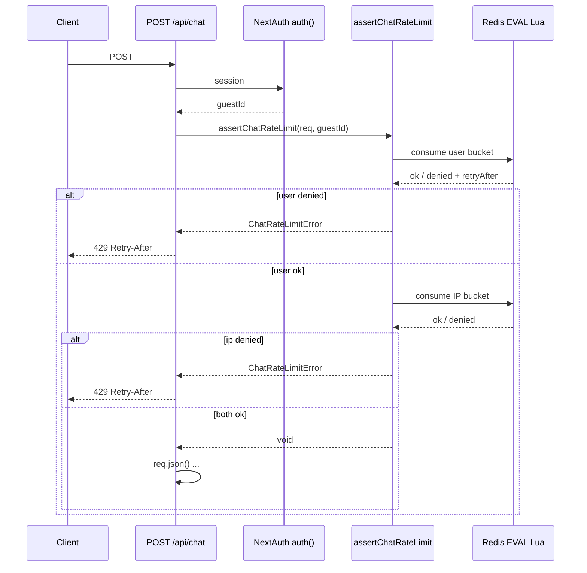

# 聊天接口限流（M5）详细实现流程

> 由 feature-flow-designer 技能基于代码整理生成。

## 功能概述

对 `POST /api/chat` 在**已登录且已解析 `guestId` 之后**、**解析请求体之前**做 Redis 滑动窗口限流：先按访客（user）再按客户端 IP 两道桶；超限返回 **429** 与 **Retry-After**，Redis 缺失或错误时默认 **放行（fail-open）**，可选 **strict** 模式下改为 **503**。

## 核心技术实现

### 1. 接入点与执行顺序（Next.js Route Handler）

限流挂在 App Router 的 **Route Handler** `app/api/chat/route.ts` 的 `POST` 中。流程为：**`auth()` → 取 `guestId` → `assertChatRateLimit(req, guestId)` → `req.json()`**。这样可以在不读大 body 的情况下先消耗配额，且注释写明 **续传（resume）与新对话共用同一套配额**，避免只限新消息、不限续传的路径被滥用。

### 2. 滑动窗口算法（Redis Lua + ZSET）

核心在 `lib/chat/rateLimit.ts` 中的 `LUA_SLIDING_WINDOW`：对每个限流键使用 **有序集合 ZSET**，score 为请求时间戳（毫秒），member 为唯一串（`Date.now()` + 随机后缀，避免同毫秒冲突）。

脚本逻辑概要：

- `ZREMRANGEBYSCORE` 删掉窗口外（`score <= now - windowMs`）的记录，实现**滑动窗口**。
- 若当前集合元素数已 `>= limit`：不写入，根据**最老一条**的 score 计算 `retryAfter = oldestScore + windowMs - now`（至少 1ms），返回 `{0, retryAfter}` 表示拒绝。
- 否则 `ZADD` 当前请求，`PEXPIRE` 为 `windowMs + 1000`，返回 `{1, 0}` 表示允许。

该实现把「计数 + 窗口裁剪 + 建议重试时间」放在 **单次 EVAL** 里，减少竞态，适合多实例共用同一 Redis。

### 3. 双桶策略：先用户后 IP

`assertChatRateLimit` 依次调用 `consumeSlot`：

1. **`ratelimit:user:${guestId}`**：按登录访客维度限制（`CHAT_RATE_LIMIT_USER_MAX`，默认与 `CHAT_RATE_LIMIT_WINDOW_MS` 等在 `lib/chat/limits.ts` 的 `getRateLimitConfig()` 中读取）。
2. **`ratelimit:ip:${ipHash}`**：`ipHash` 为 `sha256(ip).slice(0, 16)`，避免把原始 IP 存进 key 明文；IP 来自 `resolveClientIp`：可选 `TRUST_PROXY` 时取 `X-Forwarded-For` 第一段，否则 `x-real-ip` / `cf-connecting-ip`，都没有则为 `"unknown"`。

任一桶失败即抛出 `ChatRateLimitError`，并带 `code`：`RATE_LIMIT_USER` 或 `RATE_LIMIT_IP`，以及 `retryAfterMs`。

### 4. HTTP 映射与可观测性

- **`ChatRateLimitError`**：返回 **429**，JSON 含 `code`，响应头 **`Retry-After`** 为秒（由 `retryAfterMs` 向上取整，至少 1 秒）。
- **`ChatRateLimitRedisError`**（如 strict 下无 Redis、或 strict 下 EVAL 失败）：返回 **503**，`code: REDIS_UNAVAILABLE`。
- 命中限流或 Redis 异常路径会通过 `chatLog` 打 `rate_limit` / `redis_unavail` 等结构化日志，便于排查。

### 5. Redis 不可用时的行为（fail-open vs strict）

- **无 Redis 客户端**（`getRateLimitRedis()` 为 `null`）：若 **`CHAT_RATE_LIMIT_STRICT` 未开启**：直接 `return`，**不拦截**；若 **strict**：抛 `ChatRateLimitRedisError`。
- **EVAL 抛错**（非上述两类 Error）：同样 **非 strict** 时记录 warn 后**放行**；**strict** 时抛 `ChatRateLimitRedisError`。

`getRateLimitRedis()`（`lib/redis/getRateLimitRedis.ts`）按环境懒加载单例：可显式 `REDIS_DRIVER=upstash|ioredis`，或自动优先用 **Upstash REST**（`UPSTASH_REDIS_REST_URL` + `TOKEN`），否则 **`REDIS_URL` + ioredis**。限流只依赖抽象接口 `RateLimitRedis.eval`（`lib/redis/rateLimitRedis.ts`），便于 Serverless 与自建 Redis 两套实现。

### 6. 与客户端重试策略的配合

`lib/sseClient/retryPolicy.ts` 将 **429** 列为可自动重试类错误之一，与限流返回的 `Retry-After` 语义一致（具体是否尊重 `Retry-After` 间隔需看调用方实现，但策略上把 429 视为可恢复）。

## 数据流 / 交互时序

## 总结

限流专门针对 **聊天 SSE 入口**，用 **Redis Lua 滑动窗口** 保证多实例下计数一致，并用 **访客 + IP 哈希** 双层控制滥用面。通过 **先于 body 解析** 做检查，降低开销并统一覆盖续传与新对话。默认在 Redis 故障时 **fail-open** 保证可用性，生产若要求 **无 Redis 则不提供服务**，可打开 **strict** 得到 **503**。配置集中在环境变量与 `getRateLimitConfig()`，与 M8 会话存储等键空间分离（会话用 `stream:session:` 等前缀，限流用 `ratelimit:*`）。

## 相关代码文件

| 路径 | 作用 |
|------|------|
| `app/api/chat/route.ts` | 调用 `assertChatRateLimit`，映射 429/503 |
| `lib/chat/rateLimit.ts` | Lua 脚本、`assertChatRateLimit`、IP 解析与哈希 |
| `lib/chat/limits.ts` | `getRateLimitConfig`、`RATE_LIMIT_ENV_KEYS` |
| `lib/redis/getRateLimitRedis.ts` | Redis 单例与驱动选择 |
| `lib/redis/rateLimitRedis.ts` | `RateLimitRedis` 抽象 |
| `lib/redis/ioredisRateLimit.ts` / `upstashRateLimit.ts` | EVAL 实现 |
| `scripts/m5-acceptance.ts` | M5 验收脚本 |

## 相关设计文档

- `docs/features/chat-enterprise-enhancements/design-m5-rate-limit.md`
- `docs/features/chat-enterprise-enhancements/feature-explainer-m5-rate-limit.md`
