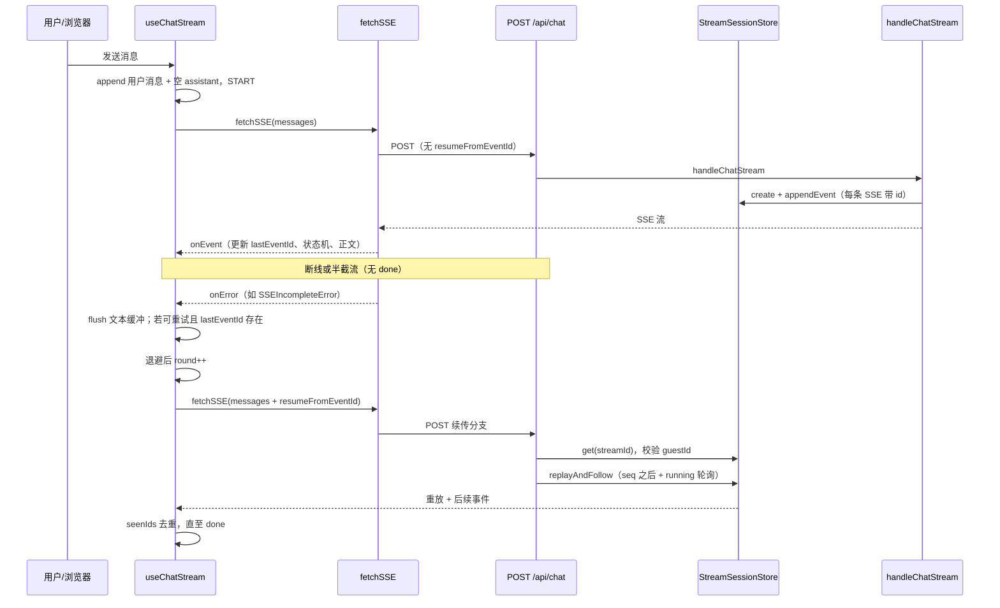

# 断线续传（SSE 断点续传）详细实现流程

## 功能概述

用户在聊天中发起流式回复后，若网络抖动、超时或连接在收到 `done` 之前被关闭，前端在**可重试**的错误类型下自动重试；重试请求携带**最后一次成功解析的 SSE `id`**，服务端从 **`StreamSessionStore` 缓冲**中重放尚未推送的事件，若生成仍在进行则**轮询跟随**直至会话结束。从而在不大改协议的前提下，尽量避免用户重复发送同一条消息。

## 核心技术实现

### 1. Next.js Route Handler 双分支与流式响应

聊天入口为 **`app/api/chat/route.ts` 的 `POST`**，使用 App Router 的 Route Handler（非 Server Action），返回 **`text/event-stream`** 响应体。

- **认证**：`auth()` 取会话，要求已登录且存在 `guestId`；未通过则 JSON 401。
- **横切能力**（新聊与续传共用）：限流 `assertChatRateLimit`、请求体校验 `validateChatRequestBody`（续传模式允许无 `messages` 或带消息做形状校验）、有 `messages` 时上下文预算 `applyBudgetOrThrow`。
- **分支**：
  - 若 body 含 **`resumeFromEventId`**：解析为 `streamId` + 序号，从 **`getStreamSessionStore()`** 取会话，校验 `guestId` 归属后，启动异步任务 **`replayAndFollow`**，向 `TransformStream` 的 writable 写入重放与后续事件；主线程立即 `return new Response(readable, { headers: sseHeaders })`。
  - 否则走 **`handleChatStream`**：新建流会话、调用模型、工具循环，同样通过 `TransformStream` 输出 SSE。

该设计把「新对话生成」与「仅重放缓冲」拆开，续传请求**不再调用 LLM**，只读 store，降低重复计费与延迟。

### 2. 服务端事件编号、缓冲与推送解耦

**`lib/sseServer/streamSession.ts`** 中，`createSSEWriter` / `createSSEWriterWithBufferLimits` 在每次发送 SSE 时：

- 递增会话序号，生成 **`id: streamId:seq`**（与 `formatSSE` 一致），并 **`appendEvent`** 到 `StreamSessionStore`（受 `CHAT_BUFFER_MAX_EVENTS` / `CHAT_BUFFER_MAX_BYTES` 等上限约束，超限可丢头）。
- 再尝试写入当前 HTTP 的 **`WritableStreamDefaultWriter`**；若写入失败（典型为客户端已断开），将 **`writerRef.current` 置空**，但**事件仍保留在 store** 中。

因此「模型仍在吐字」与「浏览器是否还连着」解耦：断线后缓冲仍在，为续传提供数据源。

**`replayAndFollow`**：以客户端上次确认的 **`seq` 为水位**，只输出 **`ev.seq > watermark`** 的已缓冲 SSE 字符串；若会话状态仍为 **`running`**，则 **50ms 轮询** `store.get`，直到 `done` / `error` 或会话消失，实现「先补历史，再跟新事件」。

### 3. 会话存储：内存默认与 Redis 可选

**`lib/sseServer/streamSessionStore.ts`** 的 **`getStreamSessionStore()`** 返回单例：

- 默认 **`MemoryStreamSessionStore`**（单进程）。
- 仅当 **`CHAT_SESSION_STORE=redis`** 且 **`getSessionRedisForStore()`** 能拿到连接时，使用 **`RedisStreamSessionStore`**（多实例部署时续传请求打到任意副本仍可命中会话）。
- 声明 Redis 但无 URL / 连接时 **回退内存** 并打日志，避免启动失败。

这与断线续传的**可用性边界**直接相关：多副本未配 Redis 时，续传可能 **404 Session expired**。

### 4. 客户端：fetch + ReadableStream、重试与游标

**`lib/sseClient/client.ts`** 的 **`fetchSSE`** 使用 **`apiFetch` + `AbortController`**（首字节超时、空闲超时），按 `\n\n` 分帧后 **`parseSSEEvent`** 解析出 **`id:`、`event:`、`data:`**。

- 若流结束但**未收到 `event: done`**，构造 **`SSEIncompleteError`**（`Stream ended without done event`），触发上层 **`onError`**，用于区分「正常结束」与「半截流」。

**`lib/sseClient/useChatStream.ts`** 中 **`sendMessage`** 在单次用户发送内维护：

- **`lastEventId`**：每个带 `id` 的 SSE 更新；**重试轮次（`round > 0`）** 时若不存在则无法续传，向用户展示固定提示并 **`dispatchChat(ERROR)`**。
- **`seenIds`**：防止重放时重复处理同一 `id`。
- **请求体**：首轮仅 `{ messages }`；重试时为 **`{ messages, resumeFromEventId: lastEventId }`**（与类型 **`ChatRequestBody`** 一致）。
- **`retryPolicy.ts`**：`isRetryableChatError` 将网络错误、超时、5xx、429、**`SSEIncompleteError`** 等标为可重试；**401/403、AbortError** 不重试；重试间隔 **`retryDelayMs` 指数退避**（上限 32s），最多 **`MAX_RETRY_ROUNDS`** 轮。

**`useChatUIStore`**：重试等待时 **`setStreamReconnecting(true)`**，收到续传后首个事件再清除，用于 UI 提示「正在重连」。

### 5. 安全与一致性

- **续传**：`route` 中比对 **`streamSession.guestId` 与当前会话 `guestId`**，防止跨用户重放。
- **限流**：续传与新聊**共用**配额（注释明确「resume 与新聊共用」），避免滥用续传绕过频率限制。
- **messages 与续传**：客户端重试时仍带 **`messages`**，但当前路由的续传分支**仅依据 `resumeFromEventId` 重放**，未做 messages 哈希校验；若需防篡改需额外设计。

### 6. 错误与边界行为

- **首包前断线**：若尚未收到任何带 `id` 的事件，`lastEventId` 为空 → **无法续传**，提示用户重发。
- **缓冲被裁剪**：超限丢头可能导致旧 `resumeFromEventId` 无法对齐 → 重放不完整或失败，依赖运维调参与产品提示。
- **`replayAndFollow`**：路由层未绑定 **`req.signal`** 时，客户端断开后台仍可能写完缓冲（资源占用与旧实现权衡）。

## 数据流 / 交互时序

## 总结

断线续传在本项目中通过 **SSE 标准 `id` 游标 + 服务端环形缓冲（`StreamSessionStore`）+ 客户端可重试与去重** 三件事闭合：Next.js Route Handler 将「新流生成」与「纯重放」分离，避免重复调用模型；`writeSSE` 先落库再尽力推送，使弱网下仍保留续传素材；`useChatStream` 用 `lastEventId` 与 `retryPolicy` 把网络层错误转成有限次自动恢复，并用 UI store 反馈重连状态。生产多副本场景需 **Redis 会话后端**，否则续传依赖单进程内存，易出现 **Session expired**。
