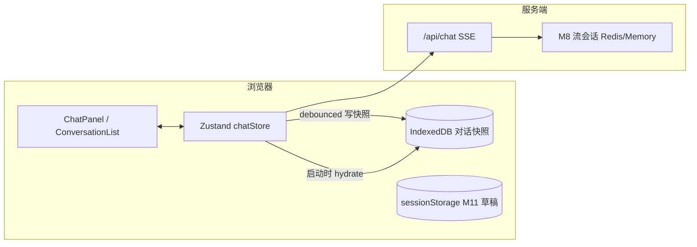

# 本机聊天持久化（IndexedDB）— 技术方案

## 决策摘要（已确认）

| 决策点 | 选择 | 说明 |
|--------|------|------|
| 范围 | **1A** | 仅本机、同浏览器；刷新/误关标签后恢复，不要求跨设备同步 |
| 存储 | **2B** | IndexedDB（配额与异步写入优于 localStorage） |
| 与 M8 关系 | **3A** | 客户端历史与 M8 流会话**解耦**；刷新后不重连进行中的 SSE；未完成的 assistant 消息按「已停止」处理 |
| 隐私与清理 | **4B** | 同源明文可接受；**登出**与 **401** 须清空本地持久化；支持用户「清空对话」 |

## 1. 总体架构



- **运行时真相**：`chatStore` 内存状态。
- **IndexedDB**：冷存储；加载时 **hydrate**，变更后 **防抖** 写回。
- **M8**：仅服务单次 SSE 续传/缓冲，**不**承担「整段对话 UI 还原」职责。

## 2. 技术选型与理由

| 选型 | 理由 |
|------|------|
| IndexedDB | 对话与 `Message[]` 体积可能较大；避免 localStorage 同步阻塞与约 5MB 上限 |
| 轻量封装 | 推荐 `idb-keyval` 或等价薄封装；避免过早引入 Dexie（除非后续需复杂查询） |
| Zustand `subscribe` + 防抖 | 序列化与写盘在 store 外执行，避免在 immer reducer 内 `await` |
| `schemaVersion` | 快照 JSON 带版本号，便于迁移与失败时清空重建 |

## 3. 性能考量

| 瓶颈 | 应对 |
|------|------|
| 高频更新触发写盘 | 对 `conversations` / `activeId` **防抖**（如 300–500ms）；M11 草稿仍走 `sessionStorage` |
| 首屏 hydrate | `requestIdleCallback` 或 `startTransition` 读 IDB 再写入 store |
| 超大会话 | 可选：单会话消息条数上限或仅保留最近 N 条（二期） |

## 4. 安全性考量

- IndexedDB 为**同源明文**，需与产品隐私预期一致。
- **登出 / 401**：与 `clearAllChatDrafts()` 同路径聚合 **`clearChatPersistence()`**（或等价命名），清空 IndexedDB 中聊天快照；**SignOutButton**、**apiFetch** 调用链需覆盖（异步清理建议 `await` 后再完成登出跳转）。
- 提供 **「清空所有对话」**：删库键或 object store，并重置 `chatStore`。

## 5. 可扩展性

- 未来 **跨设备同步**：可保留同一快照结构，替换存储层为服务端 API，store 形状尽量稳定。
- 未来 **服务端权威历史**：hydrate 可演进为「本地草稿 + 后台合并」。

## 6. 复用性设计

- 建议模块：`lib/chat/chatPersistence.ts`
  - `loadSnapshot()` / `saveSnapshot()` / `clearChatPersistence()`
  - 键名前缀与 M11 `wildoasis:chat:draft:` **区分**（如 `wildoasis:chat:snapshot:v1`）

## 7. 对现有系统的影响

| 模块 | 影响 |
|------|------|
| `store/chatStore.ts` | 外层订阅 + hydrate；可不改变对外 action 语义 |
| `lib/sseClient/useChatStream.ts` | hydrate 后若最后一条 assistant 为流式中断，应 **`markLastAssistantStreamStopped`**（或与 `buildApiMessagesForRequest` 过滤一致） |
| M8 / `StreamSessionStore` | **无接口变更** |
| `lib/chat/chatDraftStorage.ts` | 无破坏性变更；登出时与 IDB 一并清理 |
| `components/auth/SignOutButton.js`、`lib/http/apiFetch.ts` | 调用持久化清理（注意 async） |

## 8. 关键接口与数据结构草案

```ts
// 快照（示例）
interface ChatPersistenceSnapshot {
  schemaVersion: 1;
  savedAt: number;
  activeId: string | null;
  conversations: import("@/types/chat").Conversation[];
}

// lib/chat/chatPersistence.ts（草案）
export async function loadSnapshot(): Promise<ChatPersistenceSnapshot | null>;
export async function saveSnapshot(state: {
  conversations: ChatPersistenceSnapshot["conversations"];
  activeId: string | null;
}): Promise<void>;
export async function clearChatPersistence(): Promise<void>;
```

**Hydrate 后**：将 `chatState` 置为 **`idle`**（不恢复 `streaming`）；对未完成 assistant 统一收口为可识别状态（如 `streamStopped`）。

## 9. 风险与应对

| 风险 | 可能性 | 影响 | 应对措施 |
|------|--------|------|----------|
| IDB 在隐私模式/策略下不可用 | 中 | 中 | try/catch；降级为仅内存；可选告警 |
| schema 变更导致解析失败 | 中 | 低 | `schemaVersion`；不匹配则清空并重新开始 |
| 防抖窗口内崩溃丢最后一次写入 | 低 | 低 | 可选 `beforeunload` 同步写一次（不保证 100%） |
| 登出未 await 删除导致残留 | 低 | 低 | 登出流程 `await clearChatPersistence()` |
| 超大快照序列化卡顿 | 低 | 中 | 条数上限、压测 |

## 10. 实现状态

- [x] `lib/chat/chatPersistence.ts` 与依赖 `idb-keyval`
- [x] `ChatPersistenceProvider` + `chatStore` hydrate / 防抖订阅
- [x] 登出 / `apiFetch` 401 / 侧栏清空 清理 IDB
- [x] 保存时流式守卫 + 验收文档（见 [acceptance.md](acceptance.md)）

---

**关联文档**：[PROJECT_CONTEXT.md](../../../PROJECT_CONTEXT.md) · M11：[design-m10-m8-m11.md](../chat-enterprise-enhancements/design-m10-m8-m11.md)
