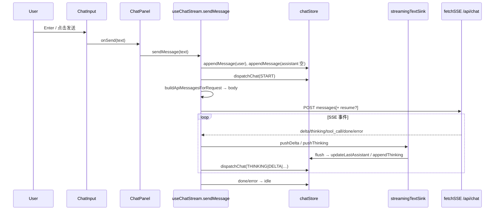

# 发送消息 — 前端详细实现流程

> 由 `/feature-flow-designer` 梳理；描述「发送消息」时前端各层操作与数据流。

## 功能概述

用户在聊天输入框输入内容并发送后，前端在**校验登录**、**维护当前会话与消息列表**的前提下，通过 **`buildApiMessagesForRequest` 拼装请求体**，用 **`fetchSSE`（内部 `apiFetch`）** 向 `/api/chat` 发起 **POST + SSE**，并在 **`createStreamingTextSink` 批量缓冲**下把 `delta` / `thinking` 写回 store，驱动 **状态机**与 **消息列表 UI** 更新；同时支持 **停止生成**、**401 回滚**、**可重试错误的断点续传**。

## 核心技术实现

### 1. 输入层：`ChatInput` 与 `ChatPanel` 串联

`ChatInput` 从 `useChatUIStore` 读取 `inputText`，用户点击发送或 **Enter（非 Shift）** 时调用 `handleSend`：对文本 `trim`，非空则调用父组件传入的 `onSend(trimmed, …)`，并 **`setInputText("")`**、清空待选文件、重置 textarea 高度。若当前 **`isResponding`**（由 `chatState !== "idle"` 推导），同一套快捷键会先走 **`onStop`**，避免叠发。

`ChatPanel` 中 **`handleSend`** 在 `inputLocked`（未登录、loading、`authBlocked`）时直接返回；否则 **`sendMessage(text)`**（来自 `useChatStream`），并再次清空输入、**`saveChatDraft(activeId, "")`**，与 M11 草稿存储同步。顶栏「停止」与输入区停止按钮均绑定 **`stopMessage`**。

说明：`ChatInput` 的 `onSend` 类型包含文件参数，但当前 **`handleSend` 只把纯文本交给 `sendMessage`**，附件能力若未在 `sendMessage` 中消费，则仅停留在输入组件层（以仓库实际调用为准）。

### 2. 发送入口：`useChatStream` 的 `sendMessage`

`lib/sseClient/useChatStream.ts` 中 **`sendMessage(text)`** 是核心编排，主要顺序如下：

1. **认证**：`auth.status === "loading"` 则直接返回；`unauthenticated` 则 **`setAuthBlocked(true)`** 并返回；已登录则清除 `authBlocked`。
2. **互斥**：若 **`chatState !== "idle"`**（上一轮仍在流式），先调用 **`stopMessage()`** 结束当前生成，再发新的一条。
3. **会话**：若无 **`activeId`**，调用 **`createConversation()`**（通常 hydrate 后已由 `ChatPanel` 建好会话，此处为兜底）。
4. **占位消息**：**`appendMessage` 用户消息**，再 **`appendMessage` 一条空的 assistant**，作为流式内容的挂载点。
5. **状态机**：**`dispatchChat({ type: "START" })`**，将 `chatState` 从 `idle` 推到 **`waiting`**（见 `lib/chat/stateMachine.ts`）。
6. **请求体**：用 **`buildApiMessagesForRequest(chatStore.activeMessages())`** 过滤 **`streamStopped` 的 assistant**、空 assistant、并处理连续双 `user` 的桥接；再映射为仅含 `role` / `content` / `toolCalls` 的数组 **`messagesToSend`**。
7. **文本缓冲**：创建 **`createStreamingTextSink`**，`onFlushDelta` → **`updateLastAssistant`**，`onFlushThinking` → **`appendThinking`**，用 **`maxDelayMs`** 做 rAF 批量写入，降低渲染频率。

### 3. SSE 请求与事件：`fetchSSEOnce` → `fetchSSE` → `handleEvent`

- 每一轮请求创建 **`AbortController`**，**`registerAbort(controller)`** 到 `chatUIStore`，供用户点击「停止」时 **`abort`**。
- **`fetchSSEOnce`** 包装 `fetchSSE`（`lib/sseClient/client.ts`），使用 **`apiFetch`** 发同源 POST，解析 SSE 行，带 **首字节超时 / 空闲超时**，并对 **`signal`** 与用户取消联动。
- **`handleEvent`**：对带 **`id`** 的事件做 **`seenIds` 去重**，维护 **`lastEventId`** 供重试时 **`resumeFromEventId`**；在 **`done` / `error`** 以及 **`tool_call` 前** 调用 **`textSink.flushAll()`**，保证顺序；将事件类型映射为 **`dispatchChat`**（`THINKING` / `DELTA` / `TOOL_CALL` / `DONE` / `ERROR`），并按类型 **`pushThinking` / `pushDelta` / `upsertToolCall`**。

`chatReducer` 在 **`waiting` → `thinking` / `answering` / `tool_calling`** 等之间切换，顶栏 **`STATE_LABEL[chatState]`** 显示「等待响应 / 正在思考 / 正在回答」等。

### 4. 重试与断点续传

**`for` 循环**最多 **`MAX_RETRY_ROUNDS`** 轮：非首轮且存在 **`lastEventId`** 时，body 带 **`resumeFromEventId`**，**`setStreamReconnecting(true)`** 并在 **`MessageList`/`MessageBubble`** 侧可显示「连接中断，正在重试…」类提示；收到续传后首个事件后清除重连标志。若无法续传则 **`setLastAssistantContent`** 提示并 **`dispatchChat({ type: "ERROR" })`**。

### 5. 结束路径与错误处理

- **正常结束**：`fetchSSEOnce` resolve → **`textSink.flushAll()`**、**`clear()`**，**`registerAbort(null)`**。
- **用户 Abort**：`AbortError` → flush + clear，保持已写入的 assistant 内容，通常配合 **`stopMessage`** 已 **`markLastAssistantStreamStopped`**。
- **401**：**不 flush**（与回滚一致），**`textSink.clear()`**，**`popLastMessages(2)`** 撤掉本轮 user+assistant，**`dispatchChat(ERROR)`**，**`setAuthBlocked(true)`**。
- **其它不可重试错误**：flush 后 **`setLastAssistantContent`** 友好文案，**`ERROR`** 状态机。

### 6. 与其它前端模块的衔接

- **`ChatPersistenceProvider`** 订阅 `chatStore`，流式中多次更新会触发 **防抖写 IndexedDB**（与发送流程无直接调用，但副作用是落盘）。
- **`buildApiMessagesForRequest`** 保证 **中断/空的 assistant** 不会进入 **`messagesToSend`**，服务端无需识别 `streamStopped` 字段。

## 数据流 / 交互时序（简化）

## 总结

发送消息的前端路径是 **UI（ChatInput + ChatPanel）→ `useChatStream.sendMessage` → Zustand 占位与状态机 → 过滤后的 `messages` POST → `fetchSSE` 解析事件 → `StreamingTextSink` 批量写回 assistant**，并在 **认证、并发单飞、401 回滚、网络重试与 SSE 续传** 各点做了分支。该设计把 **「请求长什么样」** 收敛在 **`buildApiMessagesForRequest`**，把 **「流怎么进 UI」** 收敛在 **sink + `updateLastAssistant`/`appendThinking`**，与 Next.js Route Handler 的 SSE 响应解耦清晰。

## 相关文档

- [chat-sse-client-server.md](./chat-sse-client-server.md)
- [message-persistence-flow.md](./message-persistence-flow.md)
