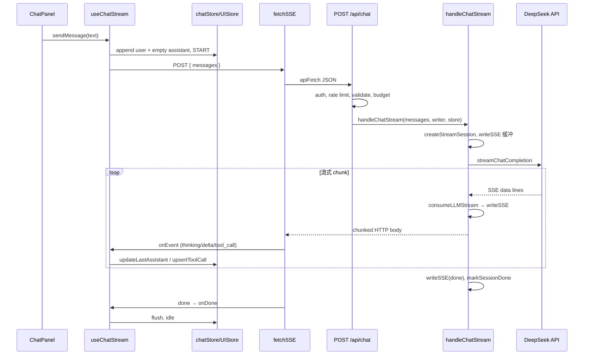
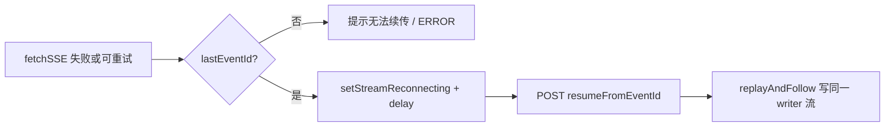

# 功能实现解析：对话（SSE，客户端 + 服务端）

## 功能概述

在已登录访客身份下，通过 **POST `/api/chat`** 建立 **Server-Sent Events（SSE）** 流：服务端把 DeepSeek 流式补全与工具调用结果转成统一事件（`thinking` / `delta` / `tool_call` / `done` / `error`），客户端用 **fetch + ReadableStream** 解析事件并更新 Zustand；支持 **事件 ID 缓冲 + 断点续传**、**自动重试**、**停止生成** 与 **401 回滚**。

---

## 代码位置

| 文件 | 职责 |
|------|------|
| `app/api/chat/route.ts` | 路由入口：鉴权、限流、校验、budget、**续传分支** vs **新对话分支**，返回 `text/event-stream` |
| `lib/sseServer/chatHandler.ts` | `handleChatStream`：创建会话、多轮工具循环、`consumeLLMStream`、`done`/错误标记 |
| `lib/sseServer/consumeLLMStream.ts` | 解析上游 LLM 的 `data:` 行，映射为 `thinking`/`delta`/工具增量 |
| `lib/sseServer/streamSession.ts` | `formatSSE` 写入器、`replayAndFollow` 续传、`parseEventId` |
| `lib/sseServer/streamSessionStore.ts` + `*.memory.ts` / `*.redis.ts` | 会话事件缓冲存储（可内存或 Redis） |
| `lib/ai/provider.ts` | `streamChatCompletion`：请求 DeepSeek 流式 API |
| `lib/sseClient/client.ts` | `fetchSSE`：POST、`apiFetch`、首字节/空闲超时、按 `\n\n` 拆包、`parseSSEEvent` |
| `lib/sseClient/useChatStream.ts` | `sendMessage` / `stopMessage`：状态机、重试、`resumeFromEventId`、文本 sink |
| `lib/sseClient/parser.ts` | 单行 SSE 块 → `SSEEvent`（含 `id`） |
| `lib/chat/stateMachine.ts` | `chatState` 与 `dispatchChat` 用的 reducer |
| `store/chatStore.ts` | 会话、消息、`updateLastAssistant`、`upsertToolCall` 等 |
| `store/chatUIStore.ts` | `AbortController`、`streamReconnecting`、`streamCancelGeneration` |
| `components/chat/ChatPanel.tsx` 等 | 调用 `useChatStream`，挂载 UI |

---

## 核心流程

### 新对话（非续传）



### 断点续传（客户端重试）

1. 服务端每条 SSE 带 `id: streamId:seq`，并 `appendEvent` 到 `StreamSessionStore`。
2. 客户端在 `handleEvent` 里记录 `lastEventId`。
3. 网络/超时等可重试错误时，`flushAll` 后下一轮请求体为 `{ messages, resumeFromEventId }`。
4. 路由走 `replayAndFollow`：重放 `seq > lastSeq` 的事件，若会话仍 `running` 则轮询直至 `done`/结束。



---

## 关键函数 / 类

| 名称 | 作用 |
|------|------|
| **`POST` `app/api/chat/route.ts`** | 鉴权（`guestId`）、`assertChatRateLimit`、`validateChatRequestBody`（`chat` vs `resume`）、`applyBudgetIfMessagesPresent`；续传时校验会话归属后 `replayAndFollow`，否则 `handleChatStream`。 |
| **`handleChatStream`** | 创建流会话；最多 `MAX_TOOL_ROUNDS` 轮：流式补全 → `consumeLLMStream` → 无工具则补发纯推理 delta、发 `done`、`markSessionDone`；异常 `markSessionError`。 |
| **`createSSEWriterWithBufferLimits`** | 每条事件递增 `seq`，`formatSSE(type, data, id)`，`store.appendEvent`，再尝试 `writer.write`；写失败则置空 writer，**仍保留缓冲供续传**。 |
| **`fetchSSE`** | `apiFetch` POST；首字节超时与 chunk 间空闲超时；按 `\n\n` 分帧；`done` 调 `onDone`；流结束且无 `done` → `SSEIncompleteError`。 |
| **`useChatStream.sendMessage`** | `buildApiMessagesForRequest` 过滤/桥接连续 user；`createStreamingTextSink` 合并 delta/thinking 刷新；重试环 + `seenIds` 去重；`stopMessage` 用 `bumpStreamCancelGeneration` + `abort`。 |

---

## 数据流（文本与状态）

- **上行**：`activeMessages()` → 过滤 `streamStopped` 的空 assistant → 序列化 `role` / `content` / `toolCalls` → JSON body。
- **下行**：SSE → `parseSSEEvent` → `SSEEvent` → `sseTypeToAction` → `dispatchChat`；`thinking`/`delta` 进 **StreamingTextSink**，定时/ rAF `flush` 到 `appendThinking` / `updateLastAssistant`；`tool_call` 前 **flushAll**，再 `upsertToolCall`（与 UI 顺序一致）。
- **UI 状态**：`chatState`（`stateMachine`）驱动「等待 / 思考 / 工具 / 回答」等展示；`streamReconnecting`、`authBlocked` 来自 `chatUIStore`。

```text
SSE chunk → parseSSEEvent → { type, data, id }
                ↓
     thinking/delta → StreamingTextSink → chatStore (最后一条 assistant)
     tool_call      → flushAll → upsertToolCall
     done/error     → flushAll → dispatchChat(DONE/ERROR)
```

---

## 状态管理

| 存储 | 内容 |
|------|------|
| **`useChatStore`**（Immer） | `conversations`、`activeId`、最后一条 assistant 的 `content` / `thinking` / `toolCalls`、`chatState`、`dispatchChat` |
| **`useChatUIStore`** | 面板与输入、`AbortController`、`streamReconnecting`、`streamCancelGeneration`（取消令牌）、`authBlocked` |
| **服务端 `StreamSessionStore`** | 按 `streamId` 存事件序列与状态，供续传与跨连接重放 |

---

## 依赖关系

- **Next.js** Route Handler、`TransformStream` 响应体。
- **NextAuth** `auth()`。
- **Zustand + Immer** 客户端状态。
- **DeepSeek** HTTP 流（`lib/ai/provider.ts`）。
- **限流 / budget / 校验**：`lib/chat/rateLimit`、`budget`、`validateRequest`、`limits`。
- **HTTP 客户端**：`lib/http/apiFetch`（含 cookie、401 时可能清会话等，与聊天联动）。

---

## 设计亮点

1. **POST + fetch 流**：不依赖 `EventSource`，可带 JSON body 与 cookie。
2. **服务端事件缓冲 + `id`**：断开仍可 `replayAndFollow`，与客户端重试、`seenIds` 去重配合。
3. **StreamingTextSink**：合并高频 delta，减轻 Immer 更新压力。
4. **工具多轮**：`handleChatStream` 内循环，工具结果以 `role: tool` 写回 messages。
5. **401**：`fetchSSE` 抛 `UNAUTHORIZED`，`sendMessage` `popLastMessages(2)` + `setAuthBlocked`，与「未 flush 缓冲」策略一致。
6. **停止**：`bumpStreamCancelGeneration` 使异步重试环检测到取消并退出。

---

## 潜在问题 / 改进点（可选）

- **续传轮询**：`replayAndFollow` 在 `running` 且无新事件时 `setTimeout(50)`，高并发时可改为订阅/推送或更长退避。
- **浏览器兼容性**：依赖 `ReadableStream`；老旧环境需 polyfill。
- **多标签页**：同一 `guestId` 多连接同时写会话存储时，依赖 store 实现的一致性（Redis 实现需注意）。

---

## 面试总结（STAR）

- **Situation**：需要流式 AI 对话，且在生产环境下处理断线、工具调用与鉴权失败。
- **Task**：实现端到端 SSE、可恢复流与可控重试，并保持 UI 流畅。
- **Action**：服务端统一 `formatSSE` + 缓冲存储 + `handleChatStream` 工具循环；客户端 `fetchSSE` 超时与完整性检测、`useChatStream` 重试与 `resumeFromEventId`、`StreamingTextSink` 批处理、Zustand 状态机。
- **Result**：断线可续传、停止与 401 行为明确、渲染侧通过 sink 降低更新频率（具体数值需实测）。

---

## 相关文档

- 断点续传专项：`docs/features/chat-enterprise-enhancements/feature-explainer-resume.md`
