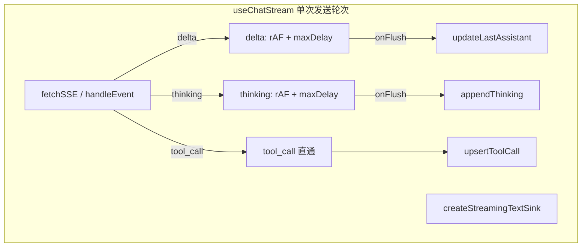

# SSE 客户端文本流 rAF 批量写入 — 技术方案

## 决策摘要（已确认）

| 决策点 | 选择 | 说明 |
|--------|------|------|
| 合并范围 | **1B** | `delta` 与 `thinking` 分路缓冲；`tool_call` 仍直通 `upsertToolCall` |
| 封装方式 | **2B** | 新增 `createStreamingTextSink`（或等价命名），集中 rAF / 定时器 / flush / clear |
| 后台 tab 兜底 | **3B** | `maxDelayMs`（建议 50–100ms）内必刷，避免纯 rAF 在后台严重降频 |
| flush 挂载点 | **4A** | 仅在 `lib/sseClient/useChatStream.ts` 内各结束路径处理；**不**改 `client.ts` 契约 |

## 1. 总体架构



- 单次 `sendMessage` 轮次内创建一个 **sink**；内含 **两路** 文本缓冲。
- 离开该轮次时（成功、错误、取消、`Abort`）调用 **`flushAll`**，再 **`clear`**，避免尾段留在队列。

## 2. 技术选型与理由

| 选型 | 理由 |
|------|------|
| 双通道 sink | `appendThinking` 与 `updateLastAssistant` 职责不同，分两路 `onFlush` 最清晰 |
| `maxDelayMs` | 后台标签页 rAF 可能极慢，定时兜底保证进度仍更新 |
| 改动限于 `useChatStream` | 与重试、401、`resumeFromEventId` 同层，不重写通用 SSE 客户端 |

## 3. 性能考量

- 将「每 token 一次 Zustand 更新」降为「每帧 / 每 maxDelay 窗口」量级，减轻 React 重渲染与 Immer 开销。
- 与 `ChatPersistenceProvider` 的防抖写盘协同，可能减少 IDB 写入触发次数。

## 4. 安全性考量

- 不改变 SSE 载荷与鉴权；无新增服务端攻击面。
- 需注意 **401 回滚** 与 **flush** 顺序：若业务要求丢弃本轮未展示缓冲，则先 **不 flush** 再 `popLastMessages`；若要求已展示与 store 一致，则先 **flushAll** 再回滚（需产品确认，实现时写死一种）。

## 5. 可扩展性

- 新增文本类事件可增第三路 buffer 或配置表驱动 `onFlush`。
- `maxDelayMs` 可常量化或后续接 env。

## 6. 复用性设计

- 建议新文件：`lib/chat/streamingTextSink.ts`。
- 现有 `lib/chat/buffer.ts` 中 `createSSEBuffer` 可作为 **内部实现** 或合并迁移。

## 7. 对现有系统的影响

| 模块 | 影响 |
|------|------|
| `useChatStream.ts` | **主要改动**：创建 sink、事件分流、全路径 `flushAll`/`clear` |
| `lib/sseClient/client.ts` | **不改** |
| `chatStore.ts` | **不改** 对外 API |
| `chatPersistence` | 一般无需改；可能减少写盘频率 |

## 8. 关键接口草案

```ts
export type StreamingTextSinkOptions = {
  maxDelayMs: number;
  onFlushDelta: (chunk: string) => void;
  onFlushThinking: (chunk: string) => void;
};

export type StreamingTextSink = {
  pushDelta: (chunk: string) => void;
  pushThinking: (chunk: string) => void;
  flushAll: () => void;
  clear: () => void;
};

export function createStreamingTextSink(
  options: StreamingTextSinkOptions
): StreamingTextSink;
```

**内部建议**：每路 `flush` 幂等；`clear` 取消 `requestAnimationFrame` 与 `setTimeout`；`flushAll` 对两路各 flush 一次。

## 9. 风险与应对

| 风险 | 可能性 | 影响 | 应对措施 |
|------|--------|------|----------|
| 某分支未 `flushAll` 导致尾字丢失 | 中 | 高 | `try/finally` 包裹单次 `fetchSSEOnce`，或集中出口函数 |
| 401 与 flush 顺序错误 | 中 | 高 | 与产品对齐后单一顺序；代码评审 checklist |
| 定时器泄漏 | 中 | 中 | `clear` 内 `clearTimeout`；轮次结束必 `clear` |
| 无 `requestAnimationFrame` 环境 | 低 | 低 | 仅客户端执行；可降级为同步 flush |

## 10. 实现状态

- [x] `lib/chat/streamingTextSink.ts`
- [x] `useChatStream.ts` 接入与全路径 flush/clear
- [ ] （可选）废弃或内联 `buffer.ts` 中未使用导出

---

**关联**：[PROJECT_CONTEXT.md](../../../PROJECT_CONTEXT.md) · 本机持久化：[chat-persistence-local-idb/design.md](../chat-persistence-local-idb/design.md)
