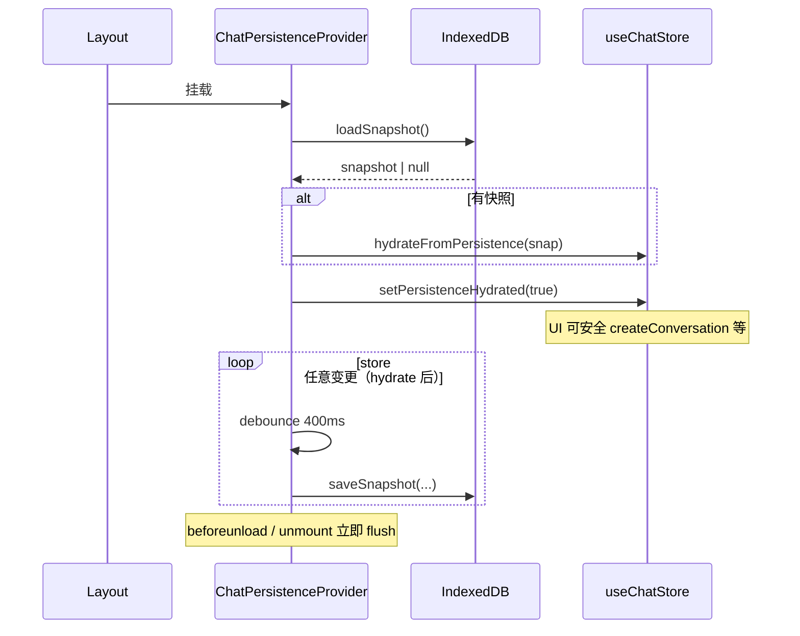

# 功能实现解析：消息持久化（本机 IndexedDB）

> 由对话中「消息持久化」功能说明整理保存；与 `chat-persistence-local-idb` 设计文档互补（偏实现细节与面试表述）。

## 功能概述

在刷新、关闭标签页或短暂断网后仍能恢复 **多会话对话列表与消息内容**；通过 **IndexedDB** 存整份 `conversations + activeId` 快照，并与 Zustand `chatStore` 双向同步。

**不**提供跨设备/跨浏览器的云端历史同步；服务端流式会话（SSE resume）是另一套内存/Redis 会话，不等同于「聊天记录落库」。

## 代码位置

| 文件 | 职责 |
|------|------|
| `lib/chat/chatPersistence.ts` | IndexedDB 快照的读/写/清、schema 校验、流式保存防护与加载归一化 |
| `components/chat/ChatPersistenceProvider.tsx` | 挂载时 hydrate、订阅 store 防抖写回、`beforeunload` 尽力刷盘 |
| `store/chatStore.ts` | 内存真相源；`_persistenceHydrated`、`hydrateFromPersistence`、`clearAllConversations` |
| `app/layout.js` | 根布局包裹 `ChatPersistenceProvider`，全应用启用持久化 |
| `lib/http/apiFetch.ts` | 同源业务 API 返回 401 时清 IndexedDB 快照 + 草稿 + 内存会话并 signOut |
| `components/chat/ConversationList.tsx` | 用户「清空本机全部对话」时 `clearChatPersistence` + 草稿 + `clearAllConversations` |
| `components/auth/SignOutButton.js` | 登出时 `clearChatPersistence` |
| `lib/chat/chatDraftStorage.ts` | **独立**：`sessionStorage` 仅存 **输入框草稿**（按会话 id），不是消息列表持久化 |

## 核心流程



**步骤简述**

1. 应用启动：`loadSnapshot()` 读 `snapshot:v1`；成功则写入 `chatStore` 并把 `chatState` 置为 `idle`。
2. Hydrate 结束：`_persistenceHydrated === true`，避免在恢复前误建新会话（见 `ChatPanel`）。
3. 之后任意 `chatStore` 变更：400ms 防抖后 `saveSnapshot`。
4. 关闭页面前：`beforeunload` 与 effect 清理时 **立即** 再存一次，减少丢失。

## 关键函数 / 逻辑

### `loadSnapshot()`（`chatPersistence.ts`）

- **输入**：无（读固定 key `SNAPSHOT_KEY`）。
- **输出**：`ChatPersistenceSnapshot | null`。
- **逻辑**：无 `indexedDB` 或解析失败返回 `null`；校验 `schemaVersion === 1` 且 `conversations` 为数组，否则删坏数据并返回 `null`；对消息做 `normalizeHydratedMessages`。

### `saveSnapshot(state)`（`chatPersistence.ts`）

- **输入**：`conversations`、`activeId`、`chatState`。
- **逻辑**：先 `applyStreamingGuard`：若当前 **非 idle** 且存在活动会话，把该会话 **最后一条 assistant** 标为 `streamStopped: true`，避免刷新后把「未结束的流」当成完整回复拼进下一轮 API 请求。再 JSON 深拷贝写入（`idb-keyval` 的 `set`）。

### `applyStreamingGuard` / `normalizeHydratedMessages`

- **保存时**：流式进行中落盘 → 最后一条 assistant 视为已中断，与 `buildApiMessagesForRequest` 里过滤 `streamStopped` 的 assistant 一致（见 `useChatStream` 侧过滤逻辑）。
- **加载后**：若末尾是「空内容、无 toolCalls、未标 stopped」的 assistant，兜底标 `streamStopped`，避免孤儿占位。

### `ChatPersistenceProvider`

- **Hydrate**：仅运行一次 `useEffect([])`。
- **订阅**：`useChatStore.subscribe(scheduleSave)`，防抖 `DEBOUNCE_MS = 400`。
- **卸载/关页**：`flush()` 同步触发一次 `saveSnapshot`。

### `clearChatPersistence()`

- 删除 IndexedDB 中该快照 key；用于登出、401、用户清空本机对话。

## 数据流

```text
用户操作 / 流式更新
    → chatStore（immer 更新 conversations / activeId / chatState）
    → zustand subscribe 触发
    → 防抖 → saveSnapshot → IndexedDB

页面加载
    → loadSnapshot → hydrateFromPersistence → chatStore
    → React 组件自 chatStore 读 conversations / messages 渲染
```

**注意**：持久化的是 **客户端 store 的快照**，不是每次 SSE chunk 都单独写库；流式过程中高频更新会触发订阅，但由 400ms 防抖合并写入。

## 状态管理

| 状态 | 含义 |
|------|------|
| `conversations` / `activeId` | 唯一真相源，与 IndexedDB 同步 |
| `chatState` | 参与 `saveSnapshot` 的 guard；hydrate 后强制 `idle` |
| `_persistenceHydrated` | 未完成 IndexedDB 加载前为 `false`，防止逻辑误判「无会话」而新建 |

## 依赖关系

- **`idb-keyval`**：简化 IndexedDB API（`createStore` 指定 `DB_NAME` / `STORE_NAME`）。
- **Zustand + immer**：`chatStore` 结构与中间件。
- **与 `useChatStream` / `buildApiMessagesForRequest`**：`streamStopped` 语义一致，保证恢复后的消息不会错误地作为完整上下文发往 `/api/chat`。

## 设计亮点

1. **流式中落盘安全**：`applyStreamingGuard` 把「进行中」的最后一条 assistant 标为已停止，避免恢复后上下文污染。
2. **防抖 + beforeunload**：平衡写入频率与关闭页时的数据完整性。
3. **Schema 版本**：`CHAT_SNAPSHOT_SCHEMA_VERSION`，版本不匹配则删旧数据，便于以后迁移。
4. **401 / 登出 / 清空本机**：统一清理 IndexedDB + 内存 +（草稿）sessionStorage，避免串会话或脏数据。

## 潜在问题 / 改进点

- **仅本机**：换设备或清站点数据即丢失；若产品需要「账号级历史」，需服务端存储，与当前实现正交。
- **配额与隐私模式**：`saveSnapshot` / `loadSnapshot` 对异常静默处理，极端情况下可能无持久化且无明确 UI 提示。
- **超大会话**：全量 JSON 快照，极长对话可能触及存储配额或阻塞主线程（深拷贝）；可考虑分会话分 key、压缩或截断策略。

## 面试总结（STAR）

**Situation**：AI 聊天在单页内状态多、流式更新频繁，用户刷新后若丢失对话体验很差；同时流式未完成时不能把半条 assistant 当完整上下文再发给模型。

**Task**：在纯前端、无服务端消息库的前提下，实现可靠的本机对话恢复，并与现有 SSE / 鉴权流程一致。

**Action**：用 IndexedDB 存版本化快照；Provider 负责 hydrate 与防抖写回；保存时用 `chatState` 与 `streamStopped` 防护流式中间状态；401/登出/清空时统一 wipe；输入草稿单独用 `sessionStorage` 与会话 id 区分。

**Result**：刷新后恢复会话列表与消息；流式中断场景下上下文与 `buildApiMessagesForRequest` 规则一致；与 `apiFetch` 401 联动避免未登录用户残留本机会话数据。

---

**补充**：服务端 SSE 的 `StreamSessionStore`（内存/Redis）只服务断点续传与事件回放，**不**替代上述「聊天记录」本机持久化。

## 相关文档

- [chat-persistence-local-idb/design.md](./chat-persistence-local-idb/design.md)
- [PROJECT_CONTEXT.md](../../PROJECT_CONTEXT.md)（本机快照与 M8 解耦说明）
