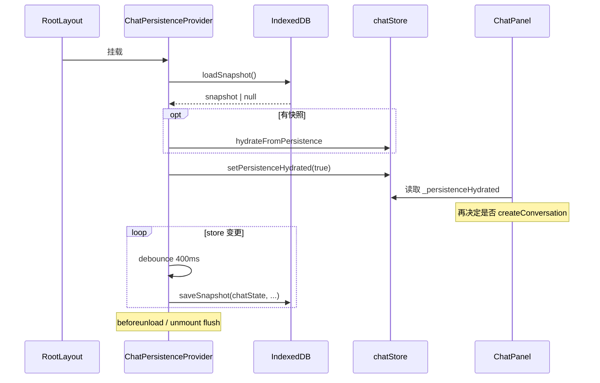

# 消息持久化设计 — 详细实现流程

> 由 `/feature-flow-designer` 梳理；与 [chat-persistence-local-idb/design.md](./chat-persistence-local-idb/design.md) 互补（偏实现步骤与框架集成）。

## 功能概述

在**同一浏览器、同源**前提下，把多会话聊天（`conversations`、当前 `activeId`）以**版本化快照**写入 **IndexedDB**，刷新或误关标签后通过 **hydrate** 恢复到 Zustand `chatStore`，避免对话丢失；并与服务端 **M8 流式会话（Redis/Memory）** 明确解耦——后者只服务单次 SSE 续传缓冲，不承担「整段 UI 对话历史」职责。

## 核心技术实现

### 1. 架构边界与 Next.js App Router 集成

方案在 `docs/features/chat-persistence-local-idb/design.md` 中已定：**运行时真相在内存 `chatStore`**，IndexedDB 只做冷存储；**不**要求跨设备同步。

根布局 `app/layout.js` 在 `AuthSessionProvider` 内使用 **Client 组件** `ChatPersistenceProvider` 包裹 `ChatPanel`，使全站聊天在挂载时先读库、再渲染业务逻辑，避免「未恢复就误建新会话」：

```36:40:app/layout.js
            <AuthSessionProvider>
              <ReservationProvider>{children}</ReservationProvider>
              <ChatPersistenceProvider>
                <ChatPanel />
              </ChatPersistenceProvider>
```

这样持久化层与页面路由解耦：任意子页面都存在同一套聊天壳，持久化生命周期与根布局一致。

### 2. IndexedDB 快照与 `idb-keyval`

`lib/chat/chatPersistence.ts` 使用 `idb-keyval` 的 `createStore` 固定数据库名 `wildoasis-chat`、对象库 `persistence`，键 **`snapshot:v1`**，与 M11 输入草稿的 `sessionStorage` 前缀**命名空间隔离**（见企业向设计文档）。

快照结构为 `ChatPersistenceSnapshot`：`schemaVersion`、`savedAt`、`activeId`、`conversations`。`loadSnapshot` 会校验 `schemaVersion === 1` 且 `conversations` 为数组，否则删除坏键并返回 `null`；加载后对每条会话做 `normalizeHydratedMessages`，兜底把「末尾空占位 assistant」标为 `streamStopped`，避免孤儿消息。

`saveSnapshot` 接收 `conversations`、`activeId` 以及 **`chatState`**，在写入前执行 **流式守卫**（见下节）。写入失败（配额、隐私模式等）在 `catch` 中静默吞掉，避免打断聊天主流程。

### 3. `ChatPersistenceProvider`：hydrate、防抖、`beforeunload`

`components/chat/ChatPersistenceProvider.tsx` 用两个 `useEffect` 分工：

**首屏 hydrate（仅执行一次）**  
异步调用 `loadSnapshot()`；若有数据则 `useChatStore.getState().hydrateFromPersistence(snap)`；无论成功与否，最终在 `finally` 里 `setPersistenceHydrated(true)`，保证 UI 侧（如 `ChatPanel`）能依赖 `_persistenceHydrated` 再决定是否 `createConversation()`，避免与快照竞态。

**hydrate 完成后的订阅写回**  
仅在 `hydrated === true` 时启用：对 `useChatStore` 使用 **`subscribe`**，任意状态变更触发 **400ms 防抖** 的 `saveSnapshot`（传入当前 `conversations`、`activeId`、`chatState`），避免流式输出高频更新时反复同步写盘。同时注册 **`beforeunload`** 与 effect 清理时的 **`flush`**：取消防抖定时器并立即 `saveSnapshot`，降低「关页瞬间丢失最后一次防抖」的概率（浏览器不保证 100% 完成异步 IDB 写入，但比纯防抖更稳）。

### 4. `chatStore` 与流式守卫（与 SSE 语义对齐）

`store/chatStore.ts` 中 `hydrateFromPersistence` 把快照写入 `conversations` / `activeId`，并**强制 `chatState` 为 `idle`**，不恢复「正在流式」的中间态——与设计文档「刷新后不续连进行中的 SSE」一致。

`saveSnapshot` 内的 `applyStreamingGuard`：若当前 **`chatState !== "idle"`** 且存在 `activeId`，则在**副本**上把当前会话**最后一条 assistant** 标为 `streamStopped: true`。这样落盘内容不会在下次请求里被 `buildApiMessagesForRequest` 当成完整一轮回复拼进 `/api/chat` body，与 `useChatStream` 对 `streamStopped` 的过滤规则一致，避免上下文污染。

### 5. 清理路径与安全设计

持久化与 **登出、401、用户主动清空** 绑定，避免明文快照残留在本机：

- `SignOutButton`、`lib/http/apiFetch.ts` 在 401 处理链中调用 `clearChatPersistence()`，并配合 `clearAllChatDrafts`、`clearAllConversations`、`signOut` 等（见 `PROJECT_CONTEXT.md`）。
- `ConversationList` 提供「清空本机全部对话」，同样 `await clearChatPersistence()` 并清草稿与内存 store。

这样 **IndexedDB 同源明文** 与产品隐私预期一致：用户退出或鉴权失效时快照被清掉。

## 数据流 / 交互时序



## 总结

消息持久化设计把 **Zustand 作为唯一运行时真相**，用 **IndexedDB + 版本化快照** 做本机恢复，通过 **`ChatPersistenceProvider` 的 hydrate / 防抖 / `beforeunload` flush** 平衡性能与数据完整性，并用 **`chatState` + `streamStopped` 守卫** 与 SSE 请求拼装规则对齐。服务端 **M8** 仍只负责流事件缓冲与续传，与 **对话列表持久化** 在职责上分离，便于后续若要做「服务端权威历史」时只替换存储层而不推翻聊天 UI 状态形状。若需进一步细化「多标签页同时写入」或「超大会话截断」，可在现有 `subscribe` 与快照结构上演进，而不必改动 SSE 主链路。

## 相关文档

- [chat-persistence-local-idb/design.md](./chat-persistence-local-idb/design.md)
- [message-persistence-feature-explainer.md](./message-persistence-feature-explainer.md)
- [PROJECT_CONTEXT.md](../../PROJECT_CONTEXT.md)
