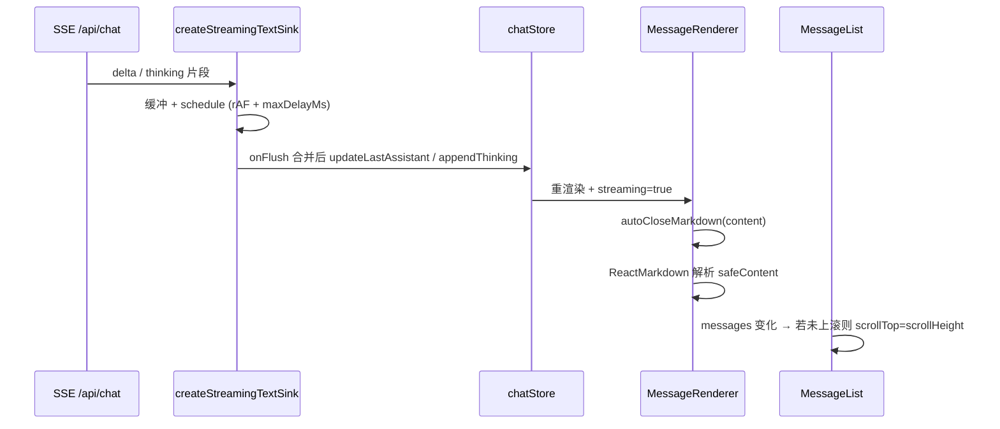

# 功能实现解析：流式 Markdown 渲染与视图稳定

## 功能概述

在 AI 助手流式输出时，通过 **未闭合 Markdown 结构的临时补全** 让 `react-markdown` 始终解析出稳定 AST，减轻「半句语法」导致的布局跳动；通过 **`createStreamingTextSink` 的 rAF + 超时兜底** 合并 SSE 增量，降低 Zustand 更新频率；通过 **跟随底部滚动 + flex/`min-w-0` 约束** 控制长回答时的滚动与横向溢出，减轻「视图漂移」感。

## 代码位置

| 文件 | 职责 |
|------|------|
| `lib/chat/mdAutoClose.ts` | 流式时对原文做轻量补全（代码块、加粗、删除线成对闭合） |
| `components/chat/MessageRenderer.tsx` | `streaming` 时调用 `autoCloseMarkdown`，再交给 `ReactMarkdown` |
| `lib/chat/streamingTextSink.ts` | **delta / thinking** 合并缓冲，`requestAnimationFrame` + `maxDelayMs` 定时 flush |
| `lib/sseClient/useChatStream.ts` | 单次发送内创建 `textSink`，SSE 事件里 `pushDelta` / `pushThinking`，关键节点 `flushAll` |
| `lib/chat/buffer.ts` | `createSSEBuffer`：仅 rAF 队列合并（当前主路径未直接引用，与设计文档中的「可合并实现」对应） |
| `components/chat/MessageList.tsx` | 列表滚动容器、`userScrolledUp` 与自动滚到底、「正在生成」回底按钮 |
| `components/chat/MessageBubble.tsx` | 气泡宽度、`min-w-0`、助手区与工具卡片的 `max-w` |
| `components/chat/ChatPanel.tsx` | 面板 `flex-1 min-h-0` 与固定高度，保证子区域可滚动 |
| `styles/globals.css` | `.chat-message-scroll`：`overflow-y: auto` 与滚动条样式 |

## 核心流程



**步骤简述**

1. `sendMessage` 为整次请求创建一个 `textSink`（`useChatStream.ts`）。
2. 每个 `delta` / `thinking` 进入 `pushDelta` / `pushThinking`，内部合并后再写入 store。
3. `done` / `error` / `tool_call` / 流结束 / 取消 / 重试前后等路径会 `flushAll()`，保证与状态机、工具节点顺序一致。
4. UI 侧最后一条 assistant 且 `chatState === "answering"` 时 `streaming={true}`，`MessageRenderer` 使用补全后的字符串做 Markdown 渲染。
5. `MessageList` 在 `messages` / `chatState` 变化时，若用户未主动上滚（距底部 > 80px 视为「在看上文」），则把滚动条设到底部。

## 关键函数 / 模块

### `autoCloseMarkdown`（`lib/chat/mdAutoClose.ts`）

- **输入**：原始流式字符串。
- **输出**：在奇数个 `` ``` `` 末尾补 `` ``` ``；奇数个 `**` / `~~` 末尾补闭合符号。
- **作用**：避免「未闭合 fence / 强调」导致整段被解析成普通文本或错误嵌套，下一 token 来时 AST 大变，从而引起 **增量重排抖动**。

### `MessageRenderer`（`components/chat/MessageRenderer.tsx`）

- 流式用补全文；结束后 `streaming=false` 使用真实内容，不再人为补字符。

### `createStreamingTextSink`（`lib/chat/streamingTextSink.ts`）

- **输入**：`maxDelayMs`（默认 80ms，见 `DEFAULT_STREAMING_TEXT_MAX_DELAY_MS`）、`onFlushDelta`、`onFlushThinking`。
- **逻辑要点**：
  - `deltaBuf` / `thinkingBuf` 分别累积；
  - `schedule()`：在无 rAF 环境直接同步 flush；否则 **预约一帧 rAF** 执行 `tick()`，并 **启动 `setTimeout(maxDelayMs)`**（注释说明：后台标签页 rAF 降频时仍推进进度）；
  - `tick()` 会 `flushDeltaLocked` + `flushThinkingLocked`，清空缓冲并调用回调。
- **与 `lib/chat/buffer.ts` 的 `createSSEBuffer` 关系**：`createSSEBuffer` 只做「队列 + 单 rAF 合并」；当前线上路径用的是功能更完整的 `createStreamingTextSink`（双通道、超时兜底）。`createSSEBuffer` 仍可作为更简封装或将来合并时的参考。

### `MessageList` 滚动策略（`components/chat/MessageList.tsx`）

- `userScrolledUp`：滚动时若距底部 > 80px，认为用户在读历史，**不再自动跟底**。
- `useEffect([messages, chatState])`：未上滚时 `scrollTop = scrollHeight`，等价于 **「粘底部」的滚动锚定行为**（实现上是脚本控制，不是 CSS `overflow-anchor`）。
- 生成中且用户已上滚时，显示 **「↓ 正在生成」** 按钮，一键恢复粘底。

### 滚动锚定与布局约束（详解）

本项目的「滚动锚定」指 **用脚本实现的粘底部（sticky-to-bottom）**，不是浏览器 CSS 的 **`overflow-anchor`**。目标是在流式增高时，默认把视口锚在最新消息；用户上滚读历史时不强行打断。

#### 滚动：何时跟底、何时停、如何恢复

| 行为 | 实现要点 |
|------|----------|
| 跟到底 | `messages` 或 `chatState` 变化时，若 `userScrolledUp.current === false`，执行 `scrollTop = scrollHeight` |
| 停止自动跟底 | `onScroll` 中若 `scrollHeight - scrollTop - clientHeight > 80`，置 `userScrolledUp = true`（认为用户在读上文） |
| 恢复粘底 | 生成中展示「↓ 正在生成」按钮：将 `userScrolledUp` 置回 `false` 并再次 `scrollTop = scrollHeight` |
| 滚动层 | 外层 `relative flex-1 min-h-0` 包住列表；内层带 `chat-message-scroll` 的节点设置 `overflow-y: auto`（见 `styles/globals.css`），仅消息区滚动，顶栏与输入区固定 |

#### 布局：高度链与宽度/溢出

| 层级 | 约束 | 作用 |
|------|------|------|
| `ChatPanel` 根 | 非全屏时 `w-[420px] h-[620px]`、`overflow-hidden` | 固定侧栏尺寸，避免被内容撑出视口 |
| 中间列 | `flex flex-col flex-1 min-w-0 min-h-0` | 在 flex 列中占满剩余高度且可收缩，子元素才能形成内部滚动 |
| `MessageList` 根 | `flex-1 min-h-0` | 与父级 `min-h-0` 配合，把可滚动高度「让」给消息列表 |
| `MessageBubble`（助手） | `max-w-[82%]`、多处 `min-w-0`、`w-full` 包裹 `MessageRenderer` | 限制气泡占宽；`min-w-0` 打破 flex 默认 `min-width: auto`，避免长单词/代码把行撑破 |
| `MessageRenderer` | `pre` 与表格外包 `overflow-x-auto` | 宽代码块、表格横向滚动，而不是撑宽气泡 |
| 容器查询 | `@container/msglist` | 按消息区宽度调节间距，窄面板下排版仍稳定 |

**一句话**：滚动锚定 = 粘底策略 + 80px 阈值 + 手动回底；布局约束 = `min-h-0` / `min-w-0` / `max-w-[82%]` + 富文本横向 `overflow-x-auto` + 面板固定高度。

## 数据流（文本）

```
SSE delta 字符串
  → textSink.pushDelta（合并）
  → onFlushDelta → chatStore.updateLastAssistant(chunk)（追加到最后一条 assistant）
  → MessageBubble → MessageRenderer(content, streaming=true)
  → autoCloseMarkdown(content) → ReactMarkdown(safeContent)
```

思考链：`pushThinking` → `appendThinking`，经 `ThinkingPanel` 展示（同样受 sink 批量刷新影响）。

## 状态管理

- **聊天内容**：Zustand `chatStore`；流式阶段通过 **降频后的** `updateLastAssistant` / `appendThinking` 更新，减少 Immer + 订阅组件的重渲染次数。
- **是否在流式**：`chatState === "answering"` 与「最后一条为 assistant」共同决定 `isStreaming`，从而控制是否启用 `autoCloseMarkdown`。

## 依赖关系

- **UI**：`react-markdown`、`remark-gfm`、`rehype-highlight`（代码高亮）。
- **流**：`fetchSSE`（`lib/sseClient/client.ts`）→ `useChatStream` → `createStreamingTextSink`。
- **样式**：Tailwind `prose`、`@container/msglist`，以及全局 `.chat-message-scroll`。

## 设计亮点

1. **Markdown 补全**：用极小字符串补丁稳定解析器输入，避免 fence/强调半开半闭引起的树结构震荡。
2. **rAF + maxDelayMs**：兼顾「跟显示器刷新合并」与「后台/节流时仍能推进」，比纯 rAF 更稳。
3. **关键事件前 flush**：`done` / `error` / `tool_call` 前 `flushAll`，避免缓冲与状态机、工具卡片顺序不一致。
4. **粘底 + 阈值**：减少长回答时「每刷一帧都打断阅读」；用户上滚后由按钮显式回底。
5. **布局**：`min-w-0`、`max-w-[82%]`、`w-full`、代码块与表格 `overflow-x-auto`，减轻宽内容把布局撑歪的「漂移」感。

## 潜在问题 / 改进点

| 点 | 说明 |
|----|------|
| `autoCloseMarkdown` 覆盖面 | 仅处理 fence、`**`、`~~`；复杂列表、链接、嵌套等仍可能在流式中途抖动，可按需扩展启发式 |
| 粘底实现 | 依赖 `scrollTop = scrollHeight`，极端情况下（图片异步增高）可能需 `ResizeObserver` 或 `scrollIntoView` 微调 |
| `createSSEBuffer` 未接入 | 若希望单一实现，可把 `createStreamingTextSink` 的内部队列抽成与 `buffer.ts` 一致，避免两套概念并存 |

## 面试总结（STAR）

- **Situation**：流式对话高频更新 store + Markdown 半片段解析，易造成卡顿与布局跳动；长回答时滚动与宽内容易打乱用户视线。
- **Task**：在不大改产品交互的前提下，稳住渲染频率与解析输入，并改善长内容下的滚动与排版。
- **Action**：流式启用 `autoCloseMarkdown`；用 `createStreamingTextSink` 做 **buffer + rAF + 超时兜底**；列表 **粘底阈值 + 手动回底**；气泡与代码块/表格 **宽度与 overflow** 约束。
- **Result**：单次 flush 合并多 token，减少 Zustand 更新次数；Markdown 树更稳；用户上滚阅读时不被强制拖到底部。

## 补充说明

与 CSS `overflow-anchor` 的区别及粘底、布局要点见上文 **「滚动锚定与布局约束（详解）」**。

## 核心代码引用

`lib/chat/mdAutoClose.ts`：

```ts
export function autoCloseMarkdown(text: string): string {
  let result = text;

  const codeBlockCount = (result.match(/```/g) ?? []).length;
  if (codeBlockCount % 2 !== 0) result += "\n```";

  const boldCount = (result.match(/\*\*/g) ?? []).length;
  if (boldCount % 2 !== 0) result += "**";

  const strikeCount = (result.match(/~~/g) ?? []).length;
  if (strikeCount % 2 !== 0) result += "~~";

  return result;
}
```

`lib/chat/streamingTextSink.ts`（schedule / tick）：

```ts
function tick() {
  clearTimers();
  flushDeltaLocked();
  flushThinkingLocked();
}

function schedule() {
  if (deltaBuf === "" && thinkingBuf === "") return;

  if (!raf) {
    flushDeltaLocked();
    flushThinkingLocked();
    return;
  }

  if (rafId === null) {
    rafId = raf(() => {
      rafId = null;
      tick();
    });
  }
  if (delayTimer === null) {
    delayTimer = setTimeout(() => {
      delayTimer = null;
      tick();
    }, maxDelayMs);
  }
}
```
